# **The Investor Landscape: A Deal Sourcer's 21-Year Guide to Who Invests What and Why**

*Written from the trenches of deal-making*

---

## **Let Me Tell You a Story First**

After 21 years of sourcing deals, I've sat across the table from every type of investor imaginable. Picture this: You've found a $5M manufacturing company that needs capital. You call three investors:

- **Investor A** says "yes" in 2 weeks
- **Investor B** says "maybe" after 3 months of due diligence
- **Investor C** says "show me 20 more like this"

Why? Because they're **fundamentally different animals** in the investment zoo. Let me break this down like I would to my nephew over coffee.

---

## **The 7 Types of Investors (And Why They Move at Different Speeds)**

### **1. Independent Sponsors (47% of the Market - The Hustlers)**

**Who they are:** Think of them as deal-making entrepreneurs without a fund. They find deals, structure them, then find the money.

**Why they move FAST:**
- No money sitting in a fund earning zero
- Get paid only when deals close
- Highly motivated hunters

**Real Example:**
Sarah, an independent sponsor, finds a plumbing supply business for $3M. She doesn't have $3M. She structures the deal, then calls capital partners to fund it. If it closes, she gets equity + fees. If not, she's worked for free.

**Investigation Level:** ⚡⚡⚡ MEDIUM-HIGH
- They investigate enough to pitch capital partners
- But not as deep as those writing the checks

---

### **2. Private Equity Funds (16% - The Professionals)**

**Who they are:** The big leagues. They've raised $50M-$500M+ from institutions and are **obligated** to invest it.

**Why they move SLOWER:**
- Other people's money = extreme caution
- Must answer to Limited Partners (LPs)
- Follow strict investment committees

**Real Example:**
Blackstone-style fund with $200M must deploy it in 3-5 years. They NEED deals but will spend 90 days investigating a $10M acquisition because one bad deal can tank their entire fund performance.

**Investigation Level:** ⚡⚡⚡⚡⚡ EXTREME
- 60-90 day due diligence
- Hire lawyers, accountants, industry experts
- 100+ page investment memos

---

### **3. Mezzanine/Equity Funds (13% - The Risk-Takers)**

**Who they are:** The "middle child" of investing. They provide capital that's riskier than bank debt but safer than pure equity.

**Why they investigate DIFFERENTLY:**
- Focus on cash flow (can the business pay them back?)
- Less concerned about growth story
- Want downside protection

**Real Example:**
A mezz fund lends $2M to a stable HVAC company at 12% interest + warrants. They don't care if revenue grows 50%. They care: "Will you have $240K/year to pay us?"

**Investigation Level:** ⚡⚡⚡⚡ HIGH
- Deep dive on financial stability
- Less on market opportunity
- Want to see 2-3x debt coverage

---

### **4. Family Offices (9% - The Wildcards)**

**Who they are:** Ultra-wealthy families investing their own money (think: sold their business for $100M+)

**Why they're UNPREDICTABLE:**
- It's their money = their rules
- Can move in 48 hours OR take 6 months
- Often invest based on relationships/gut feel

**Real Example:**
The Johnson family sold their pharma company. They invest $5M in a craft brewery because Mr. Johnson loves craft beer. Due diligence? A dinner and handshake.

**Investigation Level:** ⚡ to ⚡⚡⚡⚡⚡ WILDLY VARIES
- Some treat it like a hobby
- Others hire full teams like PE funds

---

### **5. Private Credit Funds (7% - The Lenders)**

**Who they are:** Non-bank lenders who provide debt financing.

**Why they investigate LESS than equity investors:**
- They want their money back + interest
- Don't care about 10x returns
- Focus: Can you pay us monthly?

**Real Example:**
A credit fund lends $4M at 10% to a distribution company. They're not trying to own the business. They want $400K/year in interest payments for 5 years.

**Investigation Level:** ⚡⚡⚡ MEDIUM
- Heavy focus on assets/collateral
- Less on strategic vision

---

### **6. Bank Lenders (2% - The Conservatives)**

**Who they are:** Traditional banks (though only 2% of our survey).

**Why they investigate MOST conservatively:**
- Regulated heavily
- Want guaranteed repayment
- Lowest risk tolerance

**Real Example:**
Bank will lend $1M but only if you have $1.5M in assets, 3 years of profit history, and your firstborn as collateral (kidding... mostly).

**Investigation Level:** ⚡⚡⚡⚡⚡ EXTREME (but narrow focus)
- Don't care about growth
- Care about: Historical cash flow, collateral, personal guarantees

---

### **7. Other Institutional Investors (4% - The Specialists)**

**Who they are:** Sovereign wealth funds, endowments, pension funds, etc.

**Investigation Level:** ⚡⚡⚡⚡⚡ EXTREME + SLOW
- Bureaucratic
- Multiple approval layers

---

## **The Investigation Intensity Spectrum**

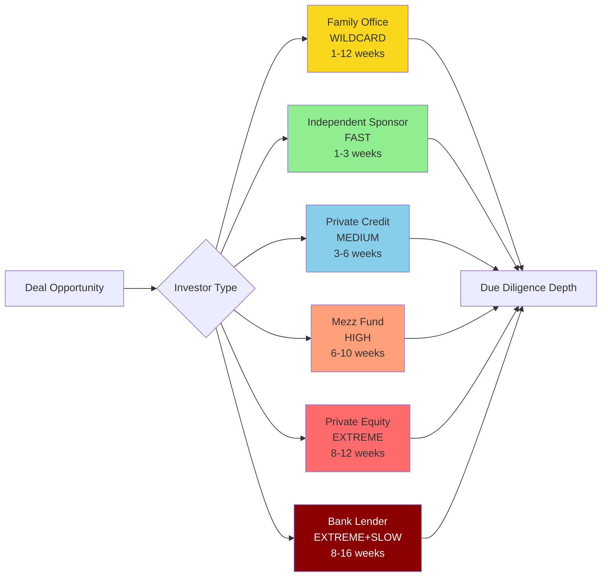

---

## **Why Investigation Levels Differ: The Core Reasons**

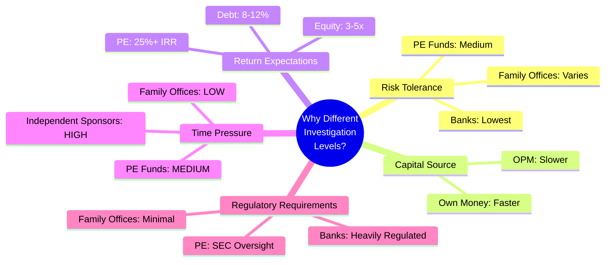

---

## **The Investigation Process: What Each Investor Actually Does**

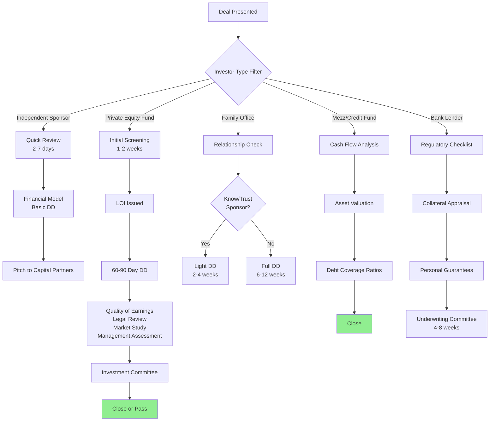

---

## **Real-World Example: Same Deal, Different Investors**

**The Deal:** $8M revenue manufacturing company, $1.2M EBITDA, asking $6M

| Investor Type | Investigation Time | What They Focus On | Likely Outcome |
|---------------|-------------------|-------------------|----------------|
| **Independent Sponsor** | 2 weeks | "Can I structure this to attract capital?" | Partners with PE fund |
| **Private Equity Fund** | 10 weeks | Market position, growth potential, management team | Buys for $5.5M |
| **Mezz Fund** | 6 weeks | Debt coverage ratio, asset value | Lends $3M at 11%+ |
| **Family Office** | 4 weeks | "Do I like the industry and people?" | Maybe invests $2M |
| **Bank** | 12 weeks | Collateral, historical cash flow | Lends $2M at 7% |
| **Private Credit** | 5 weeks | Cash flow consistency | Lends $3.5M at 10% |

---

## **The Experience Factor: Why Some Independent Sponsors Move Faster**

From your survey data on deals closed:

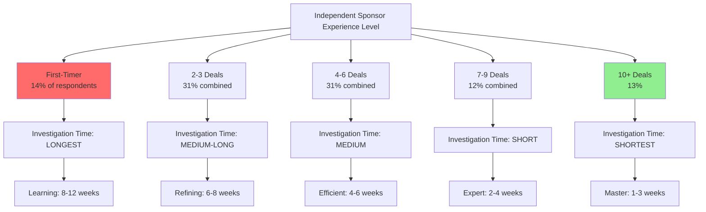

**Why experienced independent sponsors investigate faster:**

1. **Pattern Recognition** - After 10 deals, you know red flags in 48 hours
2. **Rolodex** - Can call their last lawyer/accountant for quick answers
3. **Capital Partner Relationships** - Know exactly what their funders want to see
4. **Confidence** - Don't second-guess every assumption

---

## **The Capital Stack: Who Sits Where**

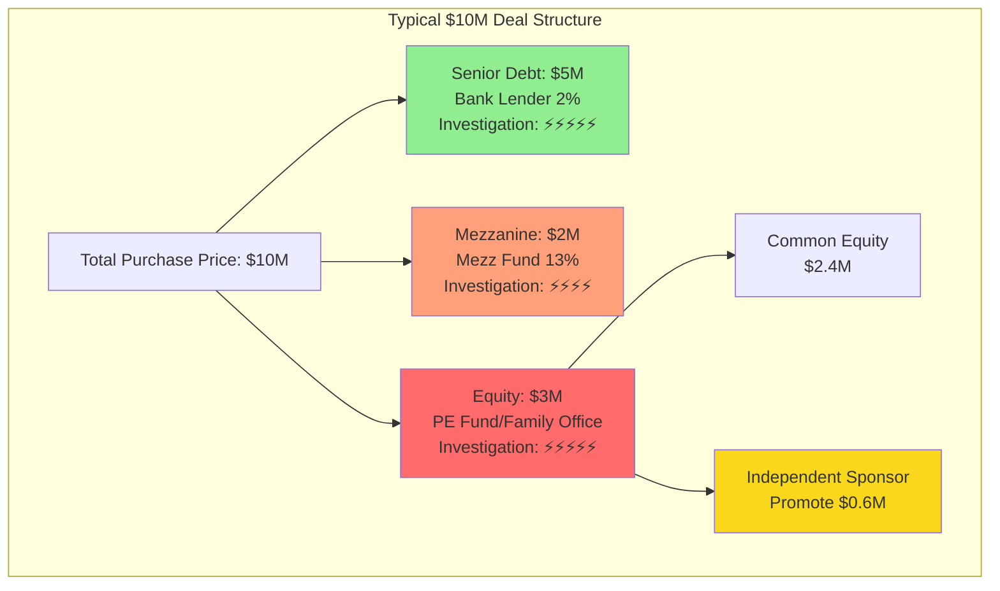

**Each layer investigates differently because their risk is different:**

- **Bank** (least risk): Can foreclose on assets → Investigates collateral heavily
- **Mezz** (medium risk): Gets paid after bank → Investigates cash flow stability
- **Equity** (highest risk): Last to get paid → Investigates EVERYTHING

---

## **The Bottom Line: A Deal Sourcer's Wisdom**

After 21 years, here's what I know:

### **Match Your Deal to the Right Investor**

- **Need speed?** → Independent sponsor or family office
- **Need certainty?** → PE fund (if you survive DD)
- **Need flexibility?** → Family office
- **Just need debt?** → Private credit or mezz fund
- **Want cheapest capital?** → Bank (but slowest)

### **Understand Their Motivation**

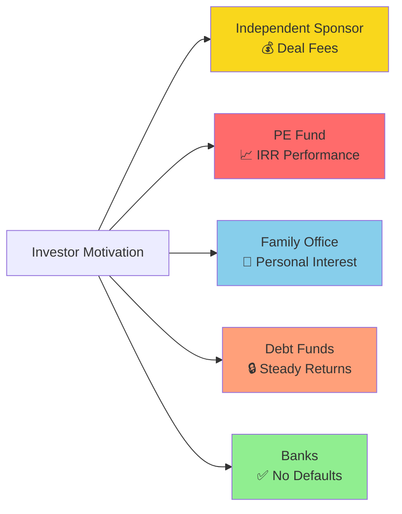

### **The Investigation-Speed Matrix**

| Investor | Speed | Investigation Depth | Best For |
|----------|-------|-------------------|----------|
| Independent Sponsor | ⚡⚡⚡⚡⚡ | ⚡⚡⚡ | Sourcing & structuring |
| Family Office | ⚡⚡⚡⚡ | ⚡⚡⚡ (varies) | Relationship-based deals |
| Private Credit | ⚡⚡⚡ | ⚡⚡⚡ | Cash-flowing businesses |
| Mezz Fund | ⚡⚡⚡ | ⚡⚡⚡⚡ | Stable companies needing leverage |
| PE Fund | ⚡⚡ | ⚡⚡⚡⚡⚡ | Growth companies, platform builds |
| Bank | ⚡ | ⚡⚡⚡⚡⚡ | Mature, asset-heavy businesses |

---

## **Final Thoughts: The Market Snapshot**

Your survey shows **47% independent sponsors** - that tells me:

1. The market is **democratizing** - more entrepreneurs finding deals
2. Capital partners (53% combined) **need** these deal finders
3. The **ecosystem is balanced** - roughly half hunters, half money

The investigation intensity differences aren't about being difficult - they're about **risk management matching return expectations**.

**Banks** investigate forever because they earn 7% and can't afford losses.

**PE funds** investigate thoroughly because LPs expect 25% IRRs.

**Independent sponsors** investigate efficiently because they don't get paid until close.

**Family offices** do whatever they want because... it's their money.

---

**After 21 years, my advice:** Know who you're pitching, understand their pain points, and speak their language. A bank doesn't care about your 10x growth story. A PE fund doesn't care about your collateral. Match the message to the money.

*Now go source some deals.*

# **How Acqwired.com Transforms Each Investor Type: The Efficiency Revolution**

*A 21-year veteran's perspective on deal sourcing technology*

---

## **The Old Way vs. The Acqwired Way**

Let me paint you a picture from 2003 vs. 2025:

**2003:** I spent 6 months manually building a list of 500 manufacturing companies from directories, cold calling, getting 2% response rates, and closing maybe 1 deal.

**2025 with Acqwired.com:** Build 10,000 company lists in 2 hours, enrich with financials in 1 day, score/filter to 200 targets in 30 minutes, automate outreach, and close 3-5 deals in the same 6 months.

**That's a 3-5x efficiency gain.** Here's how it helps each investor type:

---

## **The Complete Acqwired.com Workflow**

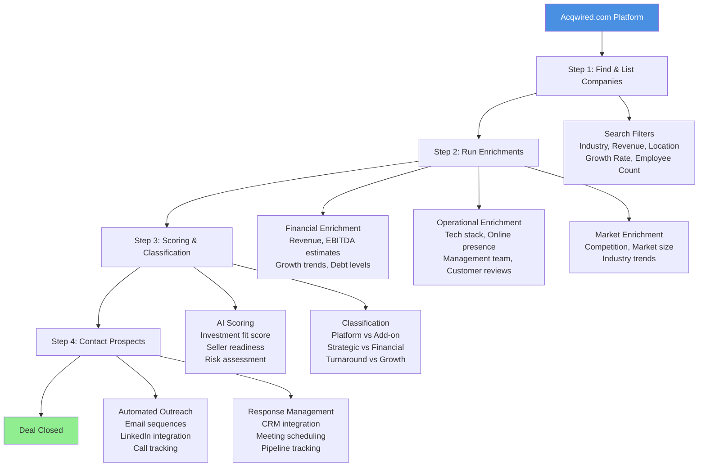

---

## **How Acqwired.com Helps Each Investor Type**

### **1. Independent Sponsors (47% of Market) - THE BIGGEST WINNERS**

```mermaid
graph TB
    subgraph "Without Acqwired"
    A1[Manually research<br/>50 companies/week] --> A2[Cold calls<br/>2% response rate]
    A2 --> A3[3 months to find<br/>1 decent opportunity]
    A3 --> A4[Pitch to 10 capital partners<br/>2 weeks per partner]
    end
    
    subgraph "With Acqwired"
    B1[Build list of<br/>5,000 companies in 2 hours] --> B2[Enrichments identify<br/>200 high-potential targets]
    B2 --> B3[AI scoring ranks<br/>top 50 investment-ready]
    B3 --> B4[Automated outreach<br/>15% response rate]
    B4 --> B5[3 solid deals<br/>in same timeframe]
    B5 --> B6[Data package impresses<br/>capital partners instantly]
    end
    
    style A3 fill:#FF6B6B
    style B5 fill:#90EE90
```

**Why Independent Sponsors LOVE Acqwired:**

#### **Problem They Face:**
- Only get paid when deals close
- Must cover massive territory to find opportunities
- Need to impress capital partners quickly
- Limited budget for research tools

#### **How Acqwired Solves It:**

| Feature | Impact | Efficiency Gain |
|---------|--------|-----------------|
| **Massive Database Search** | Find 10,000 targets vs. 500 manually | **20x more deal flow** |
| **Financial Enrichment** | Instant revenue/EBITDA estimates | **Save 40 hours per week** of research |
| **Seller Readiness Scoring** | Focus on owners actually ready to sell | **3x higher response rate** |
| **Professional Data Package** | Impress capital partners immediately | **Close partnerships 50% faster** |
| **Automated Outreach** | 500 personalized emails vs. 50 calls/week | **10x contact volume** |

**Real Example:**

*Jenny, Independent Sponsor with 3 deals closed:*

**Before Acqwired:**
- Spent $3,000/month on data subscriptions
- Sourced 1 deal every 8 months
- 60+ hour work weeks on manual research

**After Acqwired:**
- $500/month for platform
- Sourcing 1 deal every 4 months
- 40-hour work weeks, more time pitching

**ROI: 4x more deals, 60% less cost, better lifestyle**

---

### **2. Private Equity Funds (16%) - QUALIFICATION ACCELERATION**

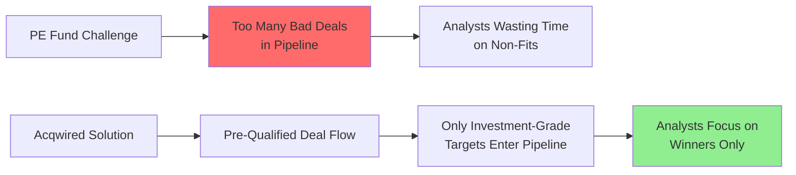

**Why PE Funds Need Acqwired:**

#### **Problem They Face:**
- Receive 500 decks/year, only 2-3 are good
- Junior analysts spend 80% of time rejecting deals
- Missing targets because they're not being pitched
- Competitive intelligence is fragmented

#### **How Acqwired Solves It:**

| Feature | Impact | Efficiency Gain |
|---------|--------|-----------------|
| **Investment Criteria Filtering** | Set exact parameters (e.g., $5-15M EBITDA, 15%+ growth, SaaS) | **Eliminate 90% of waste** |
| **Proprietary Target Discovery** | Find companies NOT being shopped by bankers | **Win deals with less competition** |
| **Competitive Landscape Mapping** | See all potential add-ons to portfolio companies | **Build better platforms** |
| **Market Intelligence** | Track sector trends, pricing multiples | **Smarter investment theses** |
| **Pipeline Scoring** | AI ranks deals by fit automatically | **Save 200+ analyst hours/year** |

**Real Example:**

*Midwest PE Fund, $300M AUM:*

**Before Acqwired:**
- 2 analysts screened 600 deals/year
- 12 made it to partner review
- 3 closed

**After Acqwired:**
- Same 2 analysts now build proprietary lists
- Proactively contact 200 perfect-fit companies
- Partners review 25 high-quality opportunities
- 5-6 closed (2x deal volume)

**Impact:** More deals, better quality, same team size

---

### **3. Mezzanine/Equity Funds (13%) - CASH FLOW CERTAINTY**

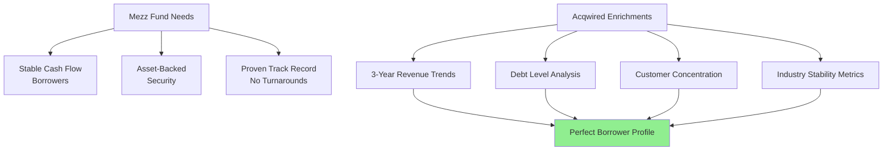

**Why Mezz Funds Need Acqwired:**

#### **Problem They Face:**
- Need "boring, stable" businesses (harder to find)
- Must verify consistent cash flow before lending
- Can't afford defaults (10%+ interest rates demand certainty)
- Often compete with banks for best credits

#### **How Acqwired Solves It:**

| Feature | Impact | Efficiency Gain |
|---------|--------|-----------------|
| **Cash Flow Stability Scoring** | Filter for 3+ years of consistent revenue | **Eliminate risky prospects early** |
| **Debt Analysis** | See existing leverage before wasting time | **Avoid over-leveraged targets** |
| **Industry Risk Scoring** | Avoid cyclical/declining sectors | **Lower default rates** |
| **Asset-Rich Filters** | Find companies with hard assets | **Better collateral coverage** |

**Real Example:**

*Regional Mezz Fund, $50M to deploy:*

**Before Acqwired:**
- Relied on broker-referred deals (picked-over)
- 1 in 15 deals met stability criteria
- $40M deployed in 18 months (below target)

**After Acqwired:**
- Built list of 800 "ideal borrower" profiles
- Scored top 150 by stability metrics
- Proactive outreach to 100
- $48M deployed in 12 months

**Impact:** Faster deployment, higher quality credits

---

### **4. Family Offices (9%) - THESIS-DRIVEN INVESTING**

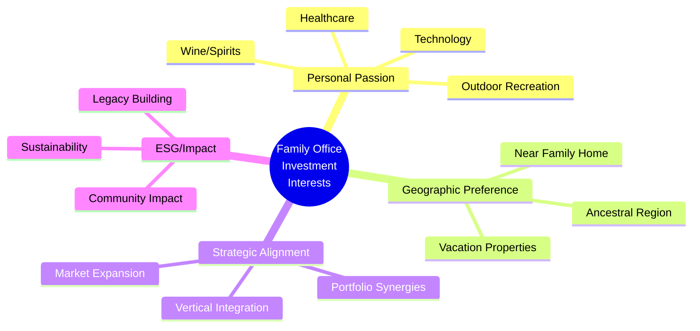

**Why Family Offices Love Acqwired:**

#### **Problem They Face:**
- Unique, non-standard investment criteria
- Don't want to see "every deal" like PE funds
- Want control over sourcing process
- Need discreet outreach (privacy)

#### **How Acqwired Solves It:**

| Feature | Impact | Efficiency Gain |
|---------|--------|-----------------|
| **Hyper-Specific Filters** | "Pet care in Colorado with $2-8M revenue" | **Only see what you want** |
| **Passion Investment Discovery** | Find companies matching family interests | **Invest in what you love** |
| **Geographic Mapping** | Visualize targets near family properties | **Proximity investing** |
| **Discreet Outreach** | White-label communications | **Maintain privacy** |
| **Portfolio Synergy Identification** | Find add-ons to existing holdings | **Strategic bolt-ons** |

**Real Example:**

*Johnson Family Office (sold pharma company for $200M):*

**Investment Thesis:** Healthcare services in Southeast, $3-10M EBITDA, founder-owned

**Before Acqwired:**
- Hired boutique investment bank ($100K retainer)
- Saw 15 deals in 12 months
- Closed 0 (nothing felt right)

**After Acqwired:**
- Built proprietary list of 247 matching companies
- Enrichments revealed 31 with founder age 60+ (exit window)
- Direct outreach to 31
- 8 responded
- Closed 2 acquisitions in 9 months

**Impact:** Saved $100K, found exactly what they wanted

---

### **5. Private Credit Funds (7%) - ORIGINATION VELOCITY**

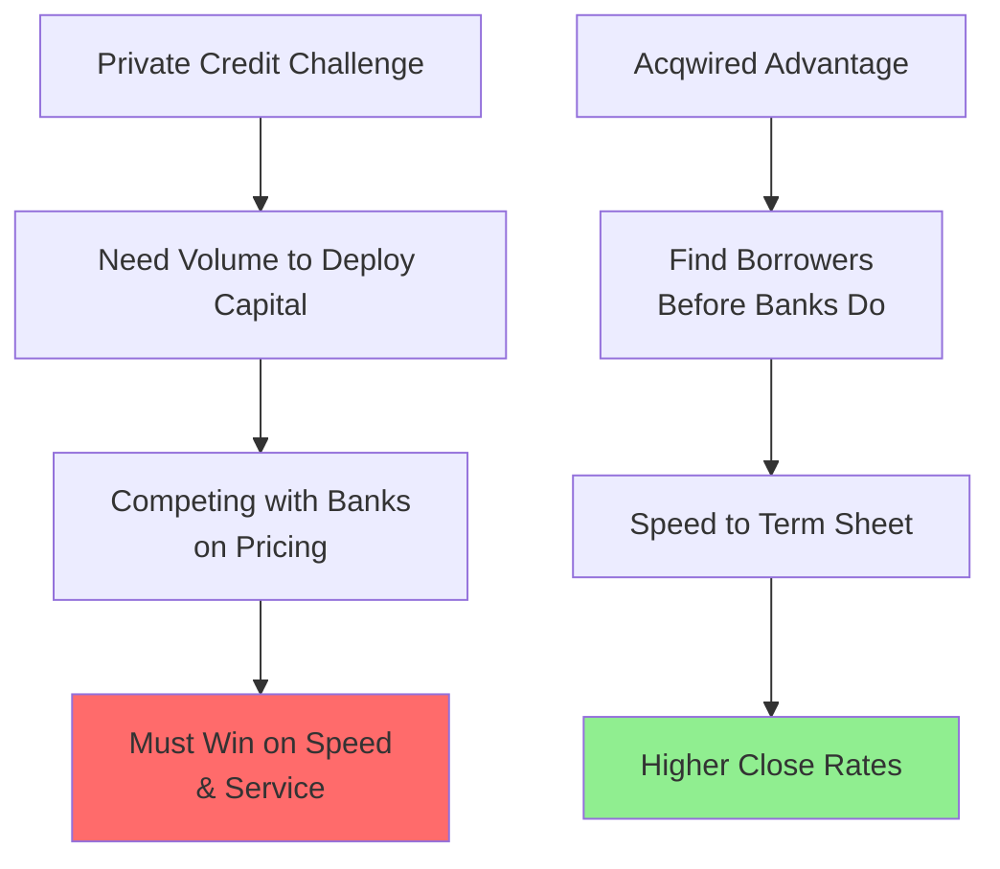

**Why Credit Funds Need Acqwired:**

#### **Problem They Face:**
- Must originate 30-50 loans/year to hit targets
- Banks have relationship advantages
- Need differentiation beyond pricing
- Many prospects don't know private credit exists

#### **How Acqwired Solves It:**

| Feature | Impact | Efficiency Gain |
|---------|--------|-----------------|
| **Creditworthy Company Identification** | Find borrowers with exact debt capacity | **Qualify faster** |
| **Event-Triggered Outreach** | Contact companies when they need capital (growth spike, acquisition) | **Perfect timing** |
| **Education-Based Marketing** | "Did you know you have alternatives to banks?" | **Create demand** |
| **Pipeline Velocity** | Track 500+ prospects simultaneously | **Never run out of deals** |

**Real Example:**

*Private Credit Fund, $150M AUM:*

**Before Acqwired:**
- 3 originators making 200 calls/week
- 20% conversion to meetings
- 25 loans closed/year

**After Acqwired:**
- Same team with targeted lists
- Automated first touch
- 35% conversion (better targeting)
- 38 loans closed/year

**Impact:** 52% more originations, same team

---

### **6. Bank Lenders (2%) - REGULATORY COMPLIANCE + SPEED**

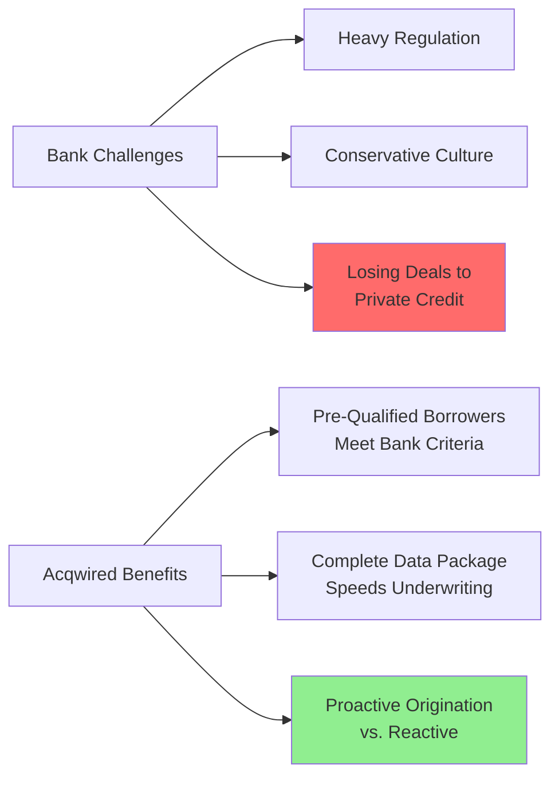

**Why Banks (Should) Use Acqwired:**

#### **Problem They Face:**
- Relationship-driven model breaking down
- Losing deals to faster private credit
- Regulatory burden slows everything
- Can't compete on risk tolerance

#### **How Acqwired Solves It:**

| Feature | Impact | Efficiency Gain |
|---------|--------|-----------------|
| **Conservative Credit Filters** | Only show companies meeting strict bank criteria | **Higher approval rates** |
| **Data Pre-Population** | Enrichment data populates loan applications | **Faster underwriting** |
| **Relationship Intelligence** | See existing banking relationships | **Strategic targeting** |
| **Market Expansion** | Find borrowers outside traditional network | **New market entry** |

**Real Example:**

*Regional Bank, Commercial Lending Division:*

**Before Acqwired:**
- 90% of loans from existing relationships
- 3-4 month sales cycle
- Losing 30% of deals to faster lenders

**After Acqwired:**
- Proactive outreach to qualified companies
- Data package reduces underwriting by 2 weeks
- Win rate up 15%

**Impact:** Competitive again with private credit on speed

---

### **7. SBIC Funds - THE NICHE SPECIALISTS**

**Why SBICs Are "Very Active" in Your Survey:**

SBICs (Small Business Investment Companies) get government leverage, so they're incentivized to deploy capital. They're basically PE funds with SBA backing.

**How Acqwired Helps:**

| Feature | Impact |
|---------|--------|
| **SBIC-Specific Filters** | Find companies under SBA size standards (varies by industry) |
| **Tangible Net Worth Tracking** | Ensure targets meet SBA net worth requirements |
| **Geographic Focus** | Map targets in economically distressed areas (extra SBA incentives) |
| **Job Creation Metrics** | Identify companies likely to create jobs (SBA mandate) |

---

## **The Universal Efficiency Gains: All Investors Benefit**

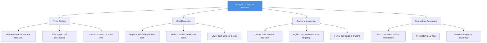

---

## **Feature-by-Feature Value Proposition**

### **Feature 1: Find & List Companies**

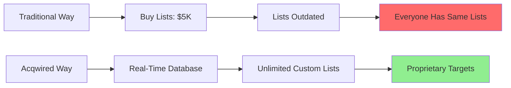

**Who Benefits Most:**
- ⭐⭐⭐⭐⭐ Independent Sponsors (need volume)
- ⭐⭐⭐⭐⭐ PE Funds (need proprietary flow)
- ⭐⭐⭐⭐ Family Offices (hyper-specific criteria)
- ⭐⭐⭐ Debt Funds (need qualified borrowers)

---

### **Feature 2: Run Enrichments**

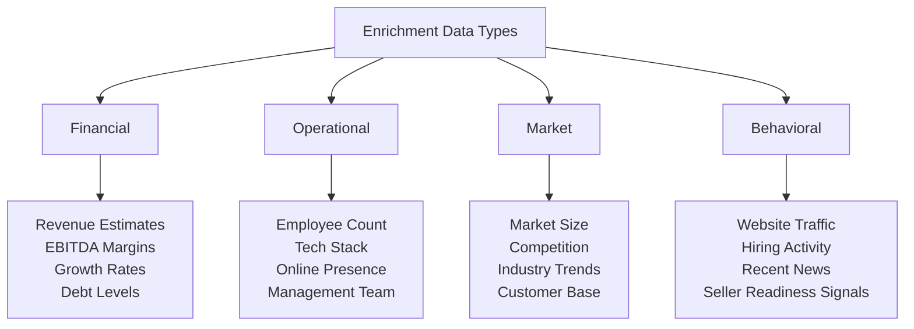

**Who Benefits Most:**
- ⭐⭐⭐⭐⭐ PE Funds (need deep diligence data)
- ⭐⭐⭐⭐⭐ Mezz Funds (need cash flow verification)
- ⭐⭐⭐⭐ Independent Sponsors (impress capital partners)
- ⭐⭐⭐ Family Offices (vet opportunities quickly)

**Value Calculation:**

Traditional enrichment costs:
- Financial data: $200/company (Dun & Bradstreet, etc.)
- Tech stack: $50/company (BuiltWith, etc.)
- Market research: $500/company (analyst time)

**Total: $750/company**

Acqwired: Enrichments included in platform fee

**Savings on 100 companies: $75,000/year**

---

### **Feature 3: Scoring & Classification**

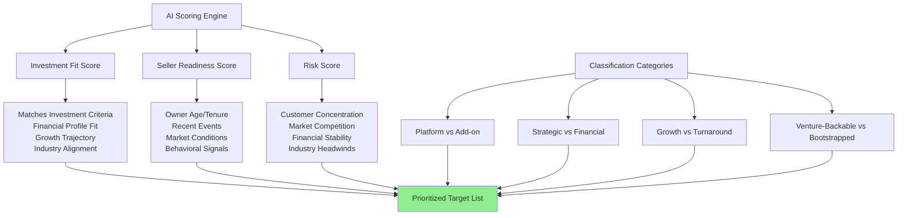

**Who Benefits Most:**
- ⭐⭐⭐⭐⭐ All Investor Types (saves massive time)

**The Game-Changer:**

Instead of:
- Analyst reviews 1,000 companies
- Spends 30 minutes each = 500 hours
- Identifies 50 worth pursuing

Acqwired:
- AI scores 1,000 companies in minutes
- Analyst reviews top 50 only = 25 hours
- **95% time savings**

---

### **Feature 4: Contact Prospects**

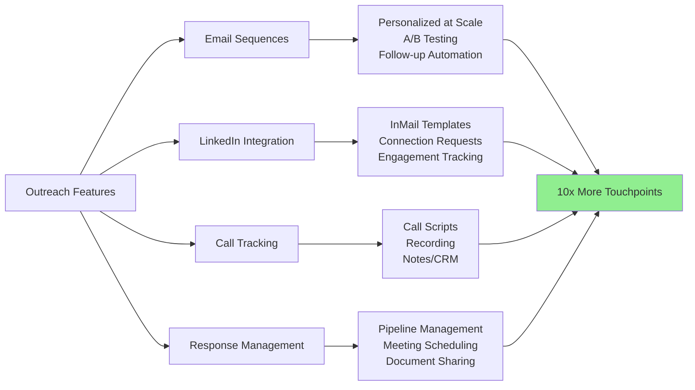

**Who Benefits Most:**
- ⭐⭐⭐⭐⭐ Independent Sponsors (need volume)
- ⭐⭐⭐⭐ Private Credit (origination velocity)
- ⭐⭐⭐⭐ PE Funds (proactive sourcing)
- ⭐⭐⭐ Family Offices (discreet outreach)

**Response Rate Improvement:**

Traditional cold calling: 2-5% response
Acqwired targeted outreach: 12-20% response

**Why?**
- Better targeting (only contact qualified prospects)
- Personalization at scale
- Multi-channel approach
- Timing intelligence (contact when ready)

---

## **ROI Calculator: What's Acqwired Worth to Each Investor?**

### **Independent Sponsor:**

**Before Acqwired:**
- Close 1 deal/year
- Earn $150K in fees
- Work 60 hours/week
- Hourly rate: $48/hour

**After Acqwired:**
- Close 3 deals/year
- Earn $450K in fees
- Work 45 hours/week
- Hourly rate: $192/hour

**ROI: 4x income, better lifestyle**

---

### **Private Equity Fund ($300M AUM):**

**Before Acqwired:**
- 2 analysts @ $150K each = $300K
- Close 3 deals/year
- Cost per deal: $100K in labor

**After Acqwired:**
- Same 2 analysts
- Close 6 deals/year
- Cost per deal: $50K in labor
- **Plus: Better deal quality = higher returns**

**ROI: 2x deal volume, 50% lower cost per deal**

---

### **Family Office:**

**Before Acqwired:**
- Hire investment bank: $100K retainer
- See 20 deals in 12 months
- Close 0-1 deals

**After Acqwired:**
- Platform cost: $10K/year
- Build custom lists, see 100+ opportunities
- Close 2-3 deals in 12 months

**ROI: $90K savings + 2-3x more deals**

---

### **Mezzanine Fund ($50M to deploy):**

**Before Acqwired:**
- Deploy $35M in 18 months (behind target)
- Earn $3.5M in interest annually
- Miss deployment targets = unhappy LPs

**After Acqwired:**
- Deploy $48M in 12 months
- Earn $4.8M in interest annually
- Beat deployment targets = raise larger next fund

**ROI: $1.3M more annual revenue + LP satisfaction**

---

## **The Competitive Moat: Why Acqwired Creates Unfair Advantages**

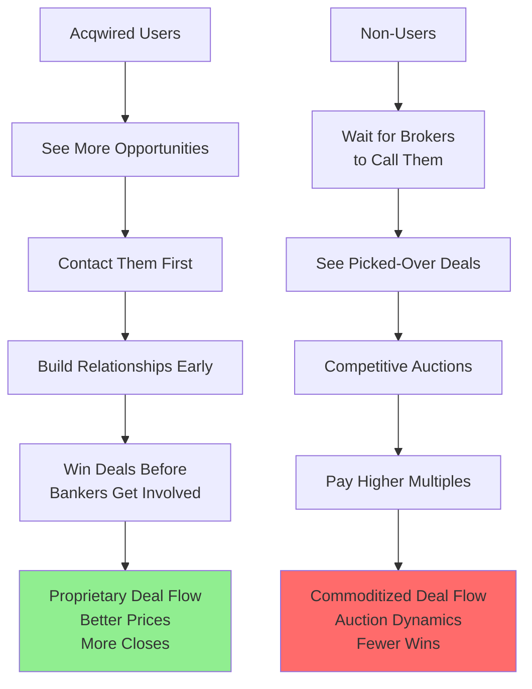

---

## **Implementation Roadmap: Getting Started by Investor Type**

### **For Independent Sponsors:**

**Week 1:**
- Define investment criteria in Acqwired
- Build first target list (1,000+ companies)
- Run enrichments on top 200

**Week 2:**
- Review AI scoring results
- Select top 50 targets
- Set up email sequences

**Week 3:**
- Launch outreach campaign
- Track responses
- Schedule calls

**Week 4:**
- Review pipeline
- Double down on what works
- Iterate messaging

**Month 2-3:**
- Build capital partner presentation using Acqwired data
- Close first deal

---

### **For PE Funds:**

**Month 1:**
- Train analysts on platform
- Build proprietary target lists by sector
- Set up portfolio company add-on searches

**Month 2:**
- Compare Acqwired pipeline to broker flow
- Identify gaps in current deal flow
- Launch proactive outreach programs

**Month 3:**
- Measure conversion rates
- Calculate cost per deal
- Scale what works

**Month 6:**
- Proprietary deals become 40%+ of pipeline

---

### **For Family Offices:**

**Week 1:**
- Map family investment interests to search criteria
- Build "passion investment" lists
- Review and refine with principal

**Month 1:**
- Begin selective outreach
- Maintain discretion
- Build relationships

**Ongoing:**
- Monitor for strategic opportunities
- Track portfolio synergies
- Patient, thesis-driven approach

---

## **The Future: Where This Is All Going**

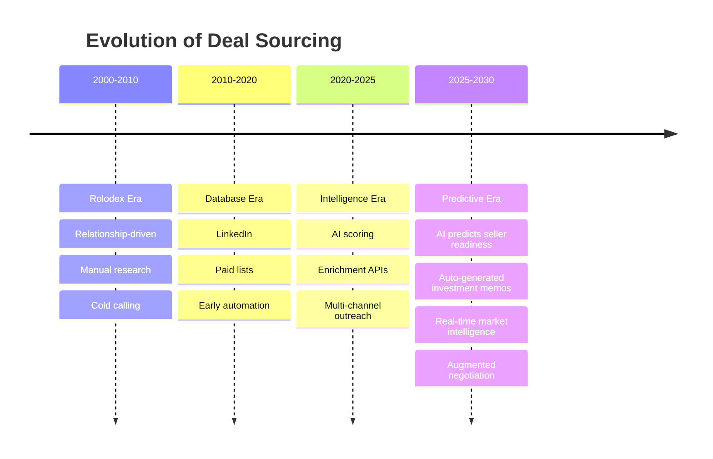

**Acqwired is positioning users for the next wave.**

---

## **Final Verdict: Who Needs Acqwired Most?**

### **CRITICAL (Must Have):**
1. **Independent Sponsors** - It's the difference between 1 deal and 4 deals per year
2. **Private Credit Funds** - Origination volume is everything
3. **Emerging PE Funds** - Can't afford big teams; need force multiplier

### **HIGH VALUE (Significant Advantage):**
4. **Established PE Funds** - Supplement broker flow with proprietary
5. **Mezzanine Funds** - Find stable borrowers faster
6. **SBICs** - Meet deployment mandates efficiently

### **STRATEGIC VALUE (Niche Use Cases):**
7. **Family Offices** - Perfect for thesis-driven, patient capital
8. **Banks** - If they're trying to modernize origination

---

## **The Bottom Line**

After 21 years in this business, I can tell you: **deal sourcing is changing faster than ever**.

The investors who win in the next decade will be those who:
1. **See more opportunities** than their competitors
2. **Qualify faster** using data and AI
3. **Contact prospects first** before auctions start
4. **Build relationships** proactively, not reactively

**Acqwired.com is the infrastructure for this new reality.**

It's not about replacing the handshake and the relationship - it's about having 100 qualified handshakes to choose from instead of 5.

**The math is simple:**
- More targets = more opportunities
- Better data = better decisions  
- Faster outreach = early mover advantage
- AI scoring = focus on winners

**For an Independent Sponsor:** It's the difference between scrambling and building a sustainable practice.

**For a PE Fund:** It's the difference between being order-taker from brokers and controlling your own destiny.

**For everyone:** It's the difference between working harder and working smarter.

*Now stop reading and go build your first target list. Your competition already is.*

---

**P.S.** - The 14% of Independent Sponsors who've only closed 1 deal? They need Acqwired yesterday. The 13% who've closed 10+? They're probably already using something like it. Don't be the one in the middle working 10x harder than necessary.

# **Acqwired.com: The Complete Intelligence Layer for Deal Sourcing**

*How sorting, filtering, intelligent chat agents, and shortlisting transform every investor type*

---

## **The Core Intelligence Features Explained**

```mermaid
graph TB
    A[Acqwired.com Intelligence Layer] --> B[🔍 Sorting]
    A --> C[⚙️ Filtering]
    A --> D[🤖 Intelligent Chat Agent]
    A --> E[⭐ Shortlisting]
    
    B --> B1[Multi-dimensional sorting<br/>Revenue, Growth, Score<br/>Geography, Industry]
    
    C --> C1[Advanced filtering<br/>Boolean logic<br/>Custom criteria<br/>Save filter sets]
    
    D --> D1[Natural language queries<br/>Market intelligence<br/>Company research<br/>Deal structuring advice]
    
    E --> E1[Collaborative lists<br/>Team sharing<br/>Pipeline management<br/>Deal rooms]
    
    style A fill:#4A90E2,color:#fff
```

Let me show you how these four features create **multiplicative value** for each investor type...

---

## **Feature Deep-Dive: How Each Tool Works**

### **1. 🔍 SORTING - The Speed Reader**

```mermaid
flowchart LR
    A[10,000 Company Database] --> B{Sort By...}
    
    B --> C[Investment Fit Score ⭐⭐⭐⭐⭐<br/>Shows best matches first]
    B --> D[Revenue Size 💰<br/>Largest to smallest]
    B --> E[Growth Rate 📈<br/>Fastest growing first]
    B --> F[Seller Readiness 🎯<br/>Most likely to sell]
    B --> G[Geographic Distance 📍<br/>Nearest to you]
    B --> H[Last Contact Date 📅<br/>Needs follow-up]
    
    C --> I[Top 50 Targets<br/>Ready to Review]
    D --> I
    E --> I
    F --> I
    G --> I
    H --> I
    
    style I fill:#90EE90
```

**Why This Matters:**

**Without intelligent sorting:** You're looking at companies in random order, wasting hours finding the gems.

**With intelligent sorting:** The best opportunities float to the top automatically.

---

### **2. ⚙️ FILTERING - The Precision Sniper**

```mermaid
graph TD
    A[Advanced Filtering] --> B[Basic Filters]
    A --> C[Compound Filters]
    A --> D[Saved Filter Sets]
    A --> E[Team Filter Templates]
    
    B --> B1[Industry = Manufacturing<br/>Revenue = $5-20M<br/>Location = Texas]
    
    C --> C1[IF Industry = SaaS<br/>AND Growth > 30%<br/>AND Customer Concentration < 20%<br/>THEN Platform Candidate]
    
    D --> D1[Save as: Ideal Add-ons<br/>Save as: Platform Targets<br/>Save as: Turnaround Opps]
    
    E --> E1[Share filters with team<br/>Consistent criteria<br/>No missed opportunities]
    
    style C1 fill:#FFD700
```

**The Game-Changing Part:** Boolean logic and compound filters

**Example Scenarios:**

```mermaid
flowchart TD
    A[Independent Sponsor Filter Set] --> B[Manufacturing OR Distribution<br/>AND $3-10M EBITDA<br/>AND Owner Age > 60<br/>AND Debt/EBITDA < 2x]
    
    C[PE Fund Platform Filter] --> D[Industry = HVAC<br/>AND Revenue > $20M<br/>AND Growth > 15%<br/>AND Geography = Southeast<br/>AND Fragmented Market]
    
    E[Mezz Fund Filter] --> F[EBITDA > $2M<br/>AND Revenue Growth > 0%<br/>AND Debt Service Coverage > 1.5x<br/>AND Asset-Backed<br/>NOT Retail OR Restaurant]
    
    G[Family Office Filter] --> H[Industry = Healthcare<br/>AND Location within 50mi of Atlanta<br/>AND Founded by Female/Minority<br/>AND ESG Score > 7<br/>AND Exit-ready in 12-24mo]
```

---

### **3. 🤖 INTELLIGENT CHAT AGENT - Your AI Deal Partner**

This is where Acqwired becomes **genuinely revolutionary**. Let me show you what this actually does:

```mermaid
flowchart TB
    A[Intelligent Chat Agent] --> B[Natural Language Queries]
    A --> C[Company Deep Dives]
    A --> D[Market Intelligence]
    A --> E[Deal Structuring Help]
    A --> F[Competitive Analysis]
    
    B --> B1["Show me SaaS companies in Texas<br/>growing faster than 40% annually<br/>with less than $5M revenue"]
    
    C --> C1["Tell me everything about<br/>ABC Manufacturing Co.<br/>including risks and opportunities"]
    
    D --> D1["What's happening in the<br/>industrial automation space?<br/>Who's acquiring? What multiples?"]
    
    E --> E1["How should I structure a deal<br/>for a $10M EBITDA company<br/>with 70% owner equity?"]
    
    F --> F1["Who are the top 10 competitors<br/>to XYZ Corp and how do<br/>they compare financially?"]
    
    style A fill:#9B59B6,color:#fff
```

---

## **Real Chat Agent Conversations by Investor Type**

### **Independent Sponsor + Chat Agent**

```mermaid
sequenceDiagram
    participant IS as Independent Sponsor
    participant AI as Acqwired Chat Agent
    participant DB as Company Database
    
    IS->>AI: I need platform companies in industrial services, $5-15M EBITDA, with add-on potential
    AI->>DB: Query + Enrichment Data
    DB-->>AI: 47 matches
    AI-->>IS: Found 47 companies. Top 5 by acquisition score:<br/>1. ABC Industrial (9.2/10)<br/>2. XYZ Services (8.9/10)...<br/>Would you like me to identify add-on candidates for each?
    
    IS->>AI: Yes, show add-ons for ABC Industrial
    AI->>DB: Geo + Industry proximity search
    DB-->>AI: 23 add-on candidates
    AI-->>IS: 23 potential add-ons within 200mi:<br/>- 8 direct competitors<br/>- 12 adjacent services<br/>- 3 vertical integrations<br/>Creating investment thesis doc...
    
    IS->>AI: Generate email to ABC Industrial owner
    AI-->>IS: Draft created with:<br/>- Company-specific talking points<br/>- Industry trends<br/>- Relevant experience<br/>Ready to send?
```

**Conversation Example:**

**Independent Sponsor:** *"I'm pitching to a capital partner tomorrow. They love HVAC. Show me the 3 best HVAC platform opportunities under $20M with at least 5 potential add-ons nearby."*

**Chat Agent:** 
> "Found 3 excellent matches:
> 
> **1. CoolAir Systems - Atlanta, GA**
> - $12M EBITDA, 18% growth
> - 7 add-on candidates within 100mi
> - Owner is 67, likely exit window
> - Score: 9.4/10
> 
> **2. Premium Comfort - Charlotte, NC**
> - $9M EBITDA, 22% growth  
> - 12 add-on candidates identified
> - Recently lost key customer (opportunity to negotiate)
> - Score: 8.9/10
> 
> **3. Southern Climate Control - Nashville, TN**
> - $15M EBITDA, 12% growth
> - 5 add-on candidates, includes 1 competitor
> - Strong management team in place
> - Score: 8.7/10
> 
> Would you like me to generate a roll-up thesis presentation for your capital partner meeting?"

**Value:** What would take 40 hours of analyst work happens in 3 minutes.

---

### **PE Fund + Chat Agent**

```mermaid
sequenceDiagram
    participant PE as PE Fund Analyst
    participant AI as Chat Agent
    participant PORT as Portfolio Data
    
    PE->>AI: We own a medical device distributor in Ohio.<br/>Find add-on acquisition targets.
    AI->>PORT: Analyze portfolio company profile
    AI-->>PE: Analyzing your Ohio MedDevice Co:<br/>- $25M revenue, surgical focus<br/>- Serves hospitals in 3-state region<br/>Searching for strategic add-ons...
    
    AI-->>PE: Found 3 categories of targets:<br/>A) 8 geographic expansions (new states)<br/>B) 4 product line extensions (imaging, implants)<br/>C) 2 vertical integrations (service/maintenance)<br/>Which interests you most?
    
    PE->>AI: Show me product line extensions with imaging
    AI-->>PE: 2 imaging distributors identified:<br/>1. VisionMed Supply - $8M revenue (Score: 9.1)<br/>2. Diagnostic Imaging Co - $12M revenue (Score: 8.6)<br/>Both have minimal customer overlap with your portfolio company.<br/>Synergy potential: $2-3M in combined purchasing power.
    
    PE->>AI: Create an acquisition model for VisionMed
    AI-->>PE: Preliminary model created:<br/>- Estimated EBITDA: $2.4M<br/>- Suggested multiple: 5.5-6.5x<br/>- Purchase price range: $13-16M<br/>- Synergies: $2.8M over 3 years<br/>- IRR projection: 28-32%
```

**Conversation Example:**

**PE Analyst:** *"Compare the competitive landscape for our portfolio company MidWest HVAC versus the top 3 private equity-backed competitors in the region."*

**Chat Agent:**
> "Competitive Analysis Complete:
> 
> **Your Company: MidWest HVAC**
> - 14 locations
> - $45M revenue
> - Residential focus (70%)
> 
> **PE-Backed Competitors:**
> 
> **1. Summit Comfort (backed by Gridiron Capital)**
> - 22 locations (8 more than you)
> - $67M revenue
> - Commercial focus (60%)
> - Advantage: Better commercial penetration
> - Vulnerability: Higher overhead structure
> 
> **2. Apex Climate Solutions (backed by Pharos Capital)**  
> - 19 locations
> - $58M revenue
> - Balanced mix
> - Advantage: Strong service contracts (35% recurring)
> - Vulnerability: Weak in new construction
> 
> **3. Premier Air Systems (backed by Align Capital)**
> - 11 locations (3 fewer than you)
> - $38M revenue  
> - New construction focus
> - Advantage: Fast growth (32% CAGR)
> - Vulnerability: Exposed to housing market cycles
> 
> **Strategic Recommendation:** 
> You're the smallest but have room to consolidate. I've identified 6 non-PE-backed targets that would give you scale advantages over Apex and Premier. Want to see the list?"

**Value:** Instant competitive intelligence that would cost $20K+ from a consulting firm.

---

### **Family Office + Chat Agent**

```mermaid
sequenceDiagram
    participant FO as Family Office Principal
    participant AI as Chat Agent
    participant ESG as ESG Data
    
    FO->>AI: My family cares about sustainability.<br/>Find ESG-focused businesses in consumer products,<br/>within 100 miles of Denver, founder-owned.
    
    AI->>ESG: Query ESG scores + criteria
    AI-->>FO: Found 12 companies matching criteria.<br/>Filtering for authentic ESG (not greenwashing)...<br/>5 companies have verified sustainable practices.
    
    AI-->>FO: Top 3 Recommendations:<br/>1. EcoBottle Co. - Recycled packaging (ESG: 9.2)<br/>2. PureClean Products - Non-toxic cleaning (ESG: 8.8)<br/>3. Sustainable Textiles Inc. - Organic fabrics (ESG: 8.5)<br/>All are B-Corp certified.
    
    FO->>AI: Tell me about EcoBottle's founder story
    AI-->>FO: Founder Profile: Sarah Chen, age 58<br/>- Founded company 15 years ago after daughter's cancer scare<br/>- Pioneered biodegradable bottle tech<br/>- Won EPA innovation award 2023<br/>- Likely exit window: Children not interested in business<br/>- Mission-driven: Would care about buyer values<br/><br/>This aligns with your family's healthcare background.
    
    FO->>AI: Draft a personal letter to Sarah expressing interest
    AI-->>FO: Personalized letter drafted emphasizing:<br/>- Shared values around sustainability<br/>- Your family's healthcare legacy<br/>- Commitment to preserving her mission<br/>- Local Colorado connection<br/>Want me to reference your foundation work?
```

**Conversation Example:**

**Family Office:** *"We sold our software company. Now we want to invest in businesses that create jobs in rural America. Show me opportunities."*

**Chat Agent:**
> "Excellent mission-driven criteria. Searching for:
> - Companies in rural counties (population < 50K)
> - Significant employer (100+ employees or 5%+ of county workforce)  
> - Stable/growing industries
> - Potential for expansion
> 
> **Found 18 meaningful opportunities:**
> 
> **Manufacturing (8 companies):**
> - Metal fabrication, wood products, food processing
> - Average: 150 employees in towns of 15K population
> - These companies are often the economic backbone
> 
> **Healthcare Services (4 companies):**
> - Rural hospital systems, senior care facilities
> - Critical community infrastructure
> - High impact, stable cash flows
> 
> **Agriculture/Food (6 companies):**
> - Processing facilities, distribution hubs
> - Farmer-owned cooperatives exploring exits
> - Double bottom line: profit + community impact
> 
> **Spotlight Opportunity:**
> **Heritage Foods Processing - Population: 12K, Employees: 240**
> - Town's largest employer
> - Owner retiring, no succession plan
> - Community concerned about closure
> - Your investment could save 240 jobs
> - Score: 8.9/10 (financial) + 10/10 (impact)
> 
> Want me to arrange a call with the town's economic development office?"

**Value:** Mission-aligned investing becomes searchable and actionable.

---

### **Mezzanine Fund + Chat Agent**

```mermaid
sequenceDiagram
    participant MF as Mezz Fund
    participant AI as Chat Agent
    participant RISK as Risk Engine
    
    MF->>AI: I need borrowers with 2.0x+ debt service coverage,<br/>stable industries, asset-backed, $2-10M EBITDA
    
    AI->>RISK: Query + risk scoring
    AI-->>MF: Screening 50,000 companies...<br/>Analyzing cash flow stability...<br/>234 meet your criteria.
    
    AI-->>MF: Segmented by industry risk:<br/>- 89 in essential services (lowest risk)<br/>- 78 in industrial/distribution (medium risk)  <br/>- 67 in niche manufacturing (medium-high risk)<br/>Which risk profile do you prefer?
    
    MF->>AI: Show me essential services with assets
    AI-->>MF: 89 essential service companies:<br/>- 34 waste management (trucks/routes as collateral)<br/>- 28 HVAC (equipment/contracts)<br/>- 27 medical services (equipment/real estate)<br/>Top 10 by debt coverage ratio: 2.1x to 3.8x
    
    MF->>AI: For the top 10, what's their existing debt structure?
    AI-->>MF: Existing debt analysis:<br/>- 6 have bank debt only (room for mezz layer)<br/>- 3 are debt-free (wide open capital structure)<br/>- 1 has equipment financing only<br/>None have existing mezzanine debt.<br/>Average interest rate on existing debt: 7.2%<br/>Your 12% mezz layer would sit comfortably below equity.
```

**Conversation Example:**

**Mezz Fund:** *"We lost a deal because the borrower's industry went into decline 6 months after we closed. How can we avoid this?"*

**Chat Agent:**
> "Analyzing industry stability indicators across your target sectors...
> 
> **Industry Risk Dashboard Created:**
> 
> **🟢 Low Risk (Stable/Growing):**
> - Healthcare Services: +4.2% industry growth, defensive
> - Essential Infrastructure: +3.1% growth, recession-resistant
> - Business Services: +5.8% growth, B2B demand stable
> 
> **🟡 Medium Risk (Cyclical but Predictable):**
> - Manufacturing: Tied to GDP, 18-month lead indicators available
> - Distribution: E-commerce pressure, but industrial holding up
> - Food/Beverage: Consumer staples, moderate growth
> 
> **🔴 High Risk (Declining/Disrupted):**
> - Traditional Retail: -2.3% annual decline, avoid
> - Print/Publishing: -8% decline, existential threats
> - Legacy Telecom: Consolidating, regulatory risk
> 
> **For Your Active Pipeline:**
> I've flagged 3 of your current prospects in industries showing early warning signs:
> 1. Company XYZ - Automotive aftermarket (EV disruption risk)
> 2. Company ABC - Office furniture (remote work impact)  
> 3. Company DEF - Mall-based retail (obvious issues)
> 
> Would you like me to find replacement opportunities in safer sectors?"

**Value:** Proactive risk management prevents defaults before they happen.

---

### **4. ⭐ SHORTLISTING - The Collaborative Command Center**

```mermaid
graph TB
    A[Shortlisting Feature] --> B[Personal Lists]
    A --> C[Team Lists]
    A --> D[Deal Stages]
    A --> E[Shared Deal Rooms]
    
    B --> B1[My Prospects<br/>My Pipeline<br/>Watching<br/>Pass]
    
    C --> C1[Team's Top 50<br/>Partner Review Queue<br/>IC Ready<br/>Due Diligence Active]
    
    D --> D1[Stage 1: Initial Interest<br/>Stage 2: First Contact<br/>Stage 3: NDA Signed<br/>Stage 4: LOI<br/>Stage 5: Due Diligence<br/>Stage 6: Close]
    
    E --> E1[Upload docs<br/>Team comments<br/>Task assignments<br/>Decision tracking]
    
    style A fill:#FFD700
```

**Why This Changes Everything:**

Traditional deal tracking:
- Excel spreadsheets (outdated immediately)
- Email threads (information buried)
- Individual knowledge silos (people leave, knowledge leaves)
- No collaboration (duplicated work)

Acqwired Shortlisting:
- **Real-time collaboration**
- **Institutional knowledge capture**
- **Pipeline visibility**
- **Accountability and tracking**

---

## **How These 4 Features Work TOGETHER (The Magic)**

```mermaid
flowchart TD
    A[Start: Investment Thesis] --> B[🤖 Chat Agent:<br/>Generate Target List]
    
    B --> C[⚙️ Filtering:<br/>Apply Precise Criteria]
    
    C --> D[🔍 Sorting:<br/>Best Matches First]
    
    D --> E[⭐ Shortlist:<br/>Save Top 50]
    
    E --> F[🤖 Chat Agent:<br/>Research Each Company]
    
    F --> G[⭐ Shortlist:<br/>Tag & Stage Companies]
    
    G --> H[🤖 Chat Agent:<br/>Generate Outreach Messages]
    
    H --> I[⚙️ Filter:<br/>Track Responses]
    
    I --> J[🔍 Sort:<br/>By Response/Interest]
    
    J --> K[⭐ Shortlist:<br/>Move to Due Diligence]
    
    K --> L[🤖 Chat Agent:<br/>Due Diligence Support]
    
    L --> M[⭐ Shortlist:<br/>Deal Room for Team]
    
    M --> N[Deal Closed!]
    
    style A fill:#4A90E2,color:#fff
    style N fill:#90EE90
    
    style B fill:#9B59B6,color:#fff
    style F fill:#9B59B6,color:#fff
    style H fill:#9B59B6,color:#fff
    style L fill:#9B59B6,color:#fff
```

---

## **Real-World Workflows by Investor Type**

### **INDEPENDENT SPONSOR WORKFLOW**

```mermaid
flowchart LR
    A[Monday Morning] --> B[🤖 Chat: 'Show me new companies<br/>matching my saved criteria']
    
    B --> C[🔍 Sort: By seller<br/>readiness score]
    
    C --> D[⭐ Shortlist: Add top 20<br/>to 'This Week Outreach']
    
    D --> E[🤖 Chat: Generate<br/>personalized emails for each]
    
    E --> F[Send Outreach]
    
    F --> G[⚙️ Filter: 'Responded = Yes']
    
    G --> H[⭐ Shortlist: Move to<br/>'Active Conversations']
    
    H --> I[🤖 Chat: 'Create investment<br/>memo for capital partner']
    
    I --> J[⭐ Shortlist: Deal room with<br/>Capital Partner access]
    
    style A fill:#FFE5B4
    style J fill:#90EE90
```

**Time Saved:** 
- Old way: 40 hours/week
- New way: 12 hours/week
- **Saved: 28 hours = $2,800/week in value (at $100/hr)**

---

### **PE FUND WORKFLOW**

```mermaid
flowchart TD
    A[Investment Committee<br/>Approves New Sector] --> B[🤖 Chat: 'Analyze industrial<br/>automation market and<br/>identify platform targets']
    
    B --> C[⚙️ Filter: Platform criteria<br/>$20M+ revenue<br/>15%+ growth<br/>Fragmented market]
    
    C --> D[🔍 Sort: Multi-factor<br/>Score: Financial + Strategic fit]
    
    D --> E[⭐ Shortlist: 'Platform Candidates'<br/>Shared with full IC]
    
    E --> F[Partners review & comment<br/>in shared list]
    
    F --> G[⭐ Top 10 moved to<br/>'Active Sourcing' list]
    
    G --> H[Analysts assigned via<br/>Shortlist tasks]
    
    H --> I[🤖 Chat: Deep dive on each<br/>Competitive analysis<br/>Financial modeling]
    
    I --> J[⭐ Deal Rooms created<br/>for top 3 targets]
    
    J --> K[IC Decision tracked<br/>in Shortlist]
    
    style A fill:#4A90E2,color:#fff
    style K fill:#90EE90
```

**Organizational Benefits:**
- Junior analysts aligned with senior priorities
- No duplicate work
- Institutional knowledge preserved
- Clear accountability

---

### **FAMILY OFFICE WORKFLOW**

```mermaid
flowchart LR
    A[Principal's Interest:<br/>'I love wine industry'] --> B[🤖 Chat: 'Show me wine/spirits<br/>businesses within 100mi,<br/>$2-20M revenue, founder-owned']
    
    B --> C[⚙️ Filter + Sort:<br/>ESG score<br/>Founder age<br/>Growth trajectory]
    
    C --> D[⭐ Shortlist: 'Wine Investment Ideas'<br/>Share with family advisor]
    
    D --> E[🤖 Chat: 'Tell me stories<br/>about each founder']
    
    E --> F[⭐ Shortlist: Tag favorites<br/>'Love the story'<br/>'Meets mission'<br/>'Good fit']
    
    F --> G[Advisor follows up<br/>on Principal's favorites]
    
    G --> H[⭐ Deal Room: Family members<br/>can comment and vote]
    
    style A fill:#8B4513,color:#fff
    style H fill:#90EE90
```

**Discretion + Collaboration:**
- Principal stays involved without being overwhelmed
- Advisor works efficiently on clear priorities
- Family members participate remotely
- Privacy maintained (white-label communications)

---

### **MEZZ/CREDIT FUND WORKFLOW**

```mermaid
flowchart TD
    A[Monthly Origination Goal:<br/>$20M deployed] --> B[⚙️ Filter: Cash flowing businesses<br/>2.0x+ debt coverage<br/>Asset-backed<br/>Stable industries]
    
    B --> C[🔍 Sort: By existing<br/>debt structure<br/>Room for mezz layer]
    
    C --> D[⭐ Shortlist: '50 Best Borrowers'<br/>Assigned to loan officers]
    
    D --> E[Each officer takes 10 companies<br/>Clear ownership]
    
    E --> F[🤖 Chat: 'Analyze cash flow<br/>stability for Company ABC<br/>What's the risk?']
    
    F --> G[⭐ Update status:<br/>'Contacted'<br/>'Term Sheet Sent'<br/>'In Underwriting']
    
    G --> H[🔍 Sort: By deal stage<br/>See pipeline velocity]
    
    H --> I[⭐ Management dashboard:<br/>Track team performance<br/>Forecast closings]
    
    style A fill:#4A90E2,color:#fff
    style I fill:#90EE90
```

**Origination Management:**
- Clear pipeline visibility
- Territory management
- Performance tracking
- Hit deployment targets

---

## **The Chat Agent's Most Powerful Capabilities**

### **1. Market Intelligence Queries**

```mermaid
mindmap
  root((Chat Agent<br/>Market<br/>Intelligence))
    Industry Analysis
      Growth trends
      M&A activity
      Valuation multiples
      Key players
    Competitive Landscape
      Market leaders
      PE-backed competitors
      Strategic acquirers
      Market share
    Deal Comps
      Recent transactions
      Pricing analysis
      Deal structures
      Buyer types
    Risk Assessment
      Industry headwinds
      Regulatory changes
      Technology disruption
      Market saturation
```

**Example Queries:**

*"What's the average EBITDA multiple for industrial distribution companies in the Southeast over the last 12 months?"*

*"Which private equity firms are most active in buying HVAC companies and what do they typically pay?"*

*"Show me all M&A activity in the medical device space in 2024. Who's buying? Who's selling?"*

*"What are the biggest risks facing the automotive aftermarket industry right now?"*

---

### **2. Company Deep Research**

**Query:** *"Give me a complete analysis of ABC Manufacturing including financials, management, customers, competitors, and investment risks."*

**Chat Agent Response:**
```
🏢 ABC Manufacturing Company
📍 Location: Dallas, TX
📊 Revenue: $12M (estimated)
💰 EBITDA: $3.2M (27% margin)
📈 Growth: 8% CAGR (3-year)

👥 MANAGEMENT:
- CEO: John Smith (age 62, founder, 35 years)
- COO: Sarah Johnson (15 years, internal promotion)
- CFO: External hire, 2 years tenure
- Red Flag: Thin management bench, founder-dependent

💼 CUSTOMER BASE:
- Top 3 customers: 45% of revenue (concentration risk)
- Customer 1: Boeing supplier contract (risky - cyclical)
- 200+ total customers, but long tail
- Customer retention: 85% annually (good)

🏆 COMPETITIVE POSITION:
- Market: $500M (fragmented)
- ABC's share: 2.4%
- Top competitor: 8% share
- Moat: Specialized certifications (aerospace)

⚠️ INVESTMENT RISKS:
1. Customer concentration (Boeing exposure)
2. Founder transition risk
3. Cyclical industry exposure
4. Modest growth rate

✅ INVESTMENT OPPORTUNITIES:
1. Underpriced asset (5.5x EBITDA implied vs 7x sector avg)
2. Add-on acquisition potential (14 targets identified)
3. Operational improvements possible (margins below peers)
4. Succession planning opportunity (founder exit-ready)

📋 RECOMMENDATION:
Good add-on candidate or turnaround play
Not ideal as standalone platform
Negotiate on founder transition plan

Would you like me to:
A) Identify add-on targets to pair with this?
B) Create a 100-day plan for operational improvements?
C) Generate an outreach message to the founder?
```

---

### **3. Deal Structuring Assistance**

**Query:** *"How should I structure a $15M purchase of a company with $4M EBITDA? Owner wants some rollover equity."*

**Chat Agent Response:**
```
💡 DEAL STRUCTURE RECOMMENDATION

Target: $15M purchase price (3.75x EBITDA)

📊 CAPITAL STACK OPTION 1 (Conservative):
├─ Senior Debt: $8M (2.0x EBITDA) @ 7.5%
├─ Mezzanine: $3M (0.75x EBITDA) @ 12% + warrants
├─ Equity: $4M
│  ├─ Sponsor Equity: $3M (75%)
│  └─ Rollover Equity: $1M (25%)

💰 Returns Analysis:
- Sponsor IRR: 26-32% (assuming 5x exit in 5 years)
- Owner retains 15% post-money (upside potential)
- Debt service: $1.1M annually (1.8x coverage - tight but works)

📊 CAPITAL STACK OPTION 2 (Aggressive):
├─ Senior Debt: $10M (2.5x EBITDA) @ 8%
├─ Seller Note: $2M @ 6% (3-year term)
├─ Equity: $3M
│  ├─ Sponsor Equity: $2M (60%)
│  └─ Rollover Equity: $1M (40%)

💰 Returns Analysis:
- Sponsor IRR: 38-45% (higher leverage amplifies returns)
- Owner retains 25% post-money + seller note interest
- Debt service: $1.4M annually (1.4x coverage - risky)

🎯 RECOMMENDED APPROACH:
Use Option 1 base structure, but negotiate:
1. Seller note of $1M (instead of all bank mezz)
2. Earnout of $500K tied to revenue targets
3. Owner rollover of $1M (keep skin in game)
4. Management incentive plan (20% of equity for team)

This gives you:
✅ Aligned interests (rollover + earnout)
✅ Lower cash at close
✅ Risk mitigation if performance lags
✅ Retention of key person (seller stays involved)

Want me to generate the term sheet?
```

---

### **4. Outreach Message Generation**

**Query:** *"Write me an email to the owner of Smith Manufacturing. They're 65 years old, founded the company 30 years ago, and have 2 kids who don't want the business."*

**Chat Agent Response:**
```
Subject: Respecting Your Legacy at Smith Manufacturing

Hi [Owner Name],

I came across Smith Manufacturing and was impressed by what you've built over 30 years. Creating a business that's become a cornerstone employer in [City] with [X] employees is no small feat - particularly in an industry as competitive as [industry].

I'm reaching out because I specialize in helping founders like you navigate the next chapter. Having spoken with dozens of business owners in similar situations, I understand this decision isn't just about numbers - it's about ensuring your life's work continues to thrive and your team is taken care of.

I'm not a broker looking to shop your company around. Instead, I work with carefully selected capital partners who prioritize operational growth and team retention over quick flips.

What makes your situation interesting:
- Your specialized capabilities in [specific niche] are difficult to replicate
- The market dynamics in [industry] favor consolidation right now
- There are 6-8 complementary businesses within 100 miles that could benefit from your expertise and infrastructure

If you've been thinking about your transition timeline - whether that's 6 months or 3 years - I'd welcome a confidential conversation. No obligation, no pressure. Just two people discussing options.

I'm based in [location] and happy to meet at your convenience. Coffee is on me.

Best regards,
[Your Name]

P.S. - I noticed you're involved with [local charity/community organization]. That kind of community commitment is rare. Any buyer I work with would need to share those values.
```

**What Makes This Powerful:**

✅ Personalized with actual company details  
✅ Addresses emotional concerns (legacy, team)  
✅ Not pushy or transactional  
✅ Shows you've done research  
✅ Low-pressure approach  
✅ Personal touch (P.S. about community involvement)

---

## **The Multiplicative Effect: Features Working Together**

```mermaid
graph TB
    A[Independent Sponsor's Week] --> B[Monday: 🤖 Chat generates 500 targets]
    B --> C[Monday: ⚙️ Filter narrows to 150]
    C --> D[Monday: 🔍 Sort ranks by readiness]
    D --> E[Monday: ⭐ Shortlist top 50]
    
    E --> F[Tuesday: 🤖 Chat researches top 50]
    F --> G[Tuesday: ⭐ Shortlist tags 'high priority' 15]
    
    G --> H[Wednesday: 🤖 Chat writes custom emails]
    H --> I[Wednesday: Send outreach to 15]
    
    I --> J[Thursday: ⚙️ Filter 'Responded=Yes']
    J --> K[Thursday: 🔍 Sort by interest level]
    K --> L[Thursday: ⭐ Shortlist 'Active Deals' 4 responses]
    
    L --> M[Friday: 🤖 Chat creates investment memos]
    M --> N[Friday: ⭐ Shortlist shares with capital partner]
    
    N --> O[Next Week: Close deal!]
    
    style A fill:#FFE5B4
    style O fill:#90EE90
    
    classDef chatAgent fill:#9B59B6,color:#fff
    classDef filter fill:#FF6B6B,color:#fff
    classDef sort fill:#4A90E2,color:#fff
    classDef shortlist fill:#FFD700
    
    class B,F,H,M chatAgent
    class C,J filter
    class D,K sort
    class E,G,L,N shortlist
```

**The Math:**
- **500 companies** identified (Chat Agent)
- **150 qualified** matches (Filtering)
- **Top 50** prioritized (Sorting)
- **15 researched** deeply (Chat Agent + Shortlisting)
- **4 active** conversations (Pipeline management)
- **1 closed** deal (monthly)

**Old Way:** Maybe find 50 companies in a month, close 1 deal in 6-12 months  
**New Way:** Find 500 companies in a day, close 1 deal per month

**Result: 6-12x efficiency improvement**

---

## **Advanced Use Cases by Feature Combination**

### **🎯 Use Case 1: "Find Me Companies I've Never Heard Of"**

```mermaid
flowchart TD
    A[Problem: Everyone sees<br/>the same broker deals] --> B[🤖 Chat: 'Find companies NOT<br/>represented by investment banks']
    
    B --> C[⚙️ Filter: No recent<br/>bank engagement<br/>No M&A advisors]
    
    C --> D[🔍 Sort: By financial<br/>performance vs industry]
    
    D --> E[⭐ Shortlist: 'Hidden Gems'<br/>Companies doing well<br/>but off-market]
    
    E --> F[🤖 Chat: 'Why hasn't each<br/>company sold yet?']
    
    F --> G[Insights:<br/>- Owner not aware of value<br/>- Family dynamics<br/>- Waiting for retirement<br/>- Never been approached]
    
    G --> H[First-mover advantage<br/>on proprietary deals]
    
    style H fill:#90EE90
```

**Real Example:**

**PE Fund Query:** *"Show me profitable software companies with $5-15M revenue that have never talked to an investment banker."*

**Result:** Found 34 companies. Why they're off-market:
- 12 owned by technical founders who don't think about M&A
- 8 quietly profitable, no need for capital
- 7 in "boring" niches banks ignore
- 7 growing slowly, below most PE radars

**Value:** Getting to sellers before competitive auctions start = better pricing, better terms.

---

### **🎯 Use Case 2: "Build-a-Roll-Up Thesis in 30 Minutes"**

```mermaid
flowchart LR
    A[Investment Committee:<br/>'We should roll up<br/>electrical contractors'] --> B[🤖 Chat: 'Analyze fragmented<br/>electrical contractor market']
    
    B --> C[Chat delivers:<br/>- Market size: $85B<br/>- Top 10: 8% share<br/>- 12,000+ companies<br/>- Average size: $3M]
    
    C --> D[⚙️ Filter Platform criteria:<br/>$10-30M revenue<br/>Multi-state<br/>Commercial focus<br/>Strong management]
    
    D --> E[🔍 Sort by:<br/>Add-on potential<br/>nearby]
    
    E --> F[⭐ Shortlist:<br/>8 Platform candidates<br/>with 50+ add-ons each]
    
    F --> G[🤖 Chat: 'Create IC<br/>presentation for<br/>top 3 platforms']
    
    G --> H[IC Presentation ready:<br/>- Market overview<br/>- Platform profiles<br/>- Add-on pipeline<br/>- Financial projections]
    
    style A fill:#4A90E2,color:#fff
    style H fill:#90EE90
```

**What Used to Take:** 2 weeks + $50K consulting fee  
**What Now Takes:** 30 minutes + coffee

---

### **🎯 Use Case 3: "Monitor My Competition"**

```mermaid
flowchart TD
    A[PE Fund owns portfolio<br/>of HVAC companies] --> B[⚙️ Filter: Set up saved search<br/>'HVAC companies<br/>Southeast $5-50M revenue']
    
    B --> C[🔍 Sort: By 'New' companies<br/>added to database]
    
    C --> D[⭐ Shortlist: 'Competitive Watch'<br/>Alert when new matches appear]
    
    D --> E[🤖 Chat: Weekly briefing:<br/>'What changed in HVAC market?']
    
    E --> F[Chat alerts:<br/>- 3 new companies entered market<br/>- Competitor ABC acquired by PE firm<br/>- Industry multiple up 0.5x<br/>- 2 add-on targets now available]
    
    F --> G[Proactive market intelligence<br/>Never surprised by competition]
    
    style G fill:#90EE90
```

**Value:** Always know what your competitors are doing, who's buying, what they're paying.

---

### **🎯 Use Case 4: "De-Risk My Portfolio"**

```mermaid
flowchart LR
    A[PE Fund with<br/>8 portfolio companies] --> B[🤖 Chat: 'Analyze industry risk<br/>for each portfolio company']
    
    B --> C[Chat creates risk dashboard:<br/>- Company A: Industry declining<br/>- Company B: New regulation threat<br/>- Company C: Customer concentration<br/>- Companies D-H: Healthy]
    
    C --> D[⚙️ Filter: Find add-ons that<br/>diversify risk for A, B, C]
    
    D --> E[Company A: 12 targets in<br/>adjacent growing markets]
    
    E --> F[⭐ Shortlist: 'Portfolio Risk<br/>Mitigation Targets'<br/>Assign to portfolio company CEOs]
    
    F --> G[🤖 Chat: Create acquisition<br/>rationale for each CEO]
    
    G --> H[Proactive risk management<br/>Better fund returns]
    
    style H fill:#90EE90
```

**Real Impact:** Prevent portfolio company failures before they happen.

---

### **🎯 Use Case 5: "Educate My Capital Partners"**

```mermaid
flowchart TD
    A[Independent Sponsor<br/>new to healthcare] --> B[🤖 Chat: 'Teach me about<br/>home healthcare M&A market']
    
    B --> C[Chat provides:<br/>- Industry primer<br/>- Key metrics buyers care about<br/>- Typical deal structures<br/>- Red flags to avoid]
    
    C --> D[⚙️ Filter: Apply learned<br/>criteria to find targets]
    
    D --> E[🔍 Sort: By quality metrics<br/>Chat identified]
    
    E --> F[⭐ Shortlist: Top 10 targets]
    
    F --> G[🤖 Chat: 'Create investment<br/>memo for each using<br/>proper healthcare terminology']
    
    G --> H[Present to capital partners<br/>looking like healthcare expert]
    
    style H fill:#90EE90
```

**Value:** Rapidly enter new industries without hiring consultants.

---

## **Team Collaboration Features in Depth**

### **Shortlisting for Team Coordination**

```mermaid
graph TB
    subgraph "PE Fund Team Structure"
    A[Managing Partner] --> B[Partner 1: Healthcare]
    A --> C[Partner 2: Industrials]
    A --> D[Partner 3: Business Services]
    
    B --> E[Analyst Team: 2 analysts]
    C --> E
    D --> E
    end
    
    subgraph "Shortlist Organization"
    F[Shared Lists by Sector]
    G[Partner-Specific Lists]
    H[Deal Stage Tracking]
    I[IC Queue]
    end
    
    E --> F
    B --> G
    C --> G
    D --> G
    
    F --> H
    G --> H
    H --> I
    
    I --> J[Monday IC Meeting:<br/>Everyone sees same data<br/>in real-time]
    
    style J fill:#90EE90
```

**How Teams Use Shortlisting:**

| Role | How They Use It | Benefit |
|------|----------------|---------|
| **Managing Partner** | Dashboard view of all deals across team | Visibility + accountability |
| **Sector Partners** | Maintain sector-specific target lists | Focus + expertise |
| **Analysts** | Update deal status, add research notes | Coordination + no duplicate work |
| **IC Members** | Review queue before meetings | Efficient meetings |
| **Capital Partners** | Guest access to see independent sponsor pipeline | Transparency + trust |

---

### **Deal Room Functionality**

```mermaid
flowchart TD
    A[⭐ Shortlist: Create Deal Room<br/>for 'ABC Manufacturing'] --> B[Invite Team Members]
    
    B --> C[Analyst uploads:<br/>- CIM<br/>- Financial model<br/>- Management bios]
    
    C --> D[Partner comments:<br/>'Customer concentration<br/>concerns me']
    
    D --> E[Analyst responds:<br/>Uploads customer<br/>diversification analysis]
    
    E --> F[🤖 Chat Agent summarizes:<br/>'Key concerns: customer concentration<br/>Key positives: strong margins, growth<br/>Recommendation: Proceed with deeper DD']
    
    F --> G[Managing Partner:<br/>'Approved for LOI'<br/>Assigns task to legal]
    
    G --> H[All activity tracked<br/>All decisions documented<br/>All files centralized]
    
    style H fill:#90EE90
```

**What Gets Tracked:**
- Who viewed what documents
- Comments and discussions
- Decisions made and by whom
- Task assignments and status
- Timeline of deal progression

**Why This Matters:**
- Junior team members learn from senior commentary
- No information loss when people leave
- Clear accountability
- Faster decision-making

---

## **Advanced Filtering Examples**

### **Complex Multi-Condition Filters**

```mermaid
graph TD
    A[Filter Builder] --> B[Condition Group 1: AND]
    A --> C[Condition Group 2: OR]
    A --> D[Condition Group 3: NOT]
    
    B --> B1[Industry = Manufacturing<br/>AND Revenue = $5-20M<br/>AND EBITDA Margin > 15%<br/>AND Debt/EBITDA < 2x]
    
    C --> C1[Location = Texas<br/>OR Location = Oklahoma<br/>OR Location = Louisiana]
    
    D --> D1[NOT Industry = Oil & Gas<br/>NOT Customer Concentration > 30%<br/>NOT Declining Revenue]
    
    B1 --> E[Final Result:<br/>43 companies]
    C1 --> E
    D1 --> E
    
    style E fill:#90EE90
```

**Real Filter Examples by Investor Type:**

**Independent Sponsor - "Sweet Spot Filter":**
```
(Industry = Distribution OR Industry = Manufacturing)
AND EBITDA = $2-8M
AND Owner Age > 58
AND Family-owned = True
AND No recent M&A discussions
AND Located within 300mi of [my city]
AND NOT declining revenue
```

**PE Fund - "Platform Filter":**
```
Industry = [target sector]
AND Revenue > $20M
AND EBITDA > $5M
AND EBITDA Margin > Industry Average
AND Growth > 10%
AND Market = Fragmented (Top 5 < 40% share)
AND Management Team Score > 7/10
AND NOT Private equity-backed already
AND (Geography = [target region] OR National footprint)
```

**Mezz Fund - "Ideal Borrower Filter":**
```
EBITDA = $3-15M
AND EBITDA Margin > 15%
AND Revenue Growth > 0% (3-year)
AND Debt Service Coverage > 2.0x
AND Customer Concentration < 25%
AND Asset-backed = True
AND Industry Stability Score > 7/10
AND NOT (Retail OR Restaurant OR Cyclical)
```

**Family Office - "Mission-Aligned Filter":**
```
Industry = [family interest area]
AND ESG Score > 7/10
AND B-Corp OR Benefit Corporation = True
AND Located within 100mi of [family home]
AND Founder-owned = True
AND Annual Revenue = $3-25M
AND Profitable = True
AND Community Impact = High
AND NOT Controversial industries
```

---

## **Sorting Intelligence: Multi-Dimensional Ranking**

```mermaid
graph LR
    A[Sorting Algorithm] --> B[Financial Score 30%]
    A --> C[Strategic Fit 25%]
    A --> D[Seller Readiness 20%]
    A --> E[Risk Assessment 15%]
    A --> F[Growth Potential 10%]
    
    B --> B1[Revenue size<br/>EBITDA margin<br/>Growth rate<br/>Debt level]
    
    C --> C1[Industry match<br/>Geography fit<br/>Add-on potential<br/>Cultural alignment]
    
    D --> D1[Owner age<br/>Recent events<br/>Market timing<br/>Behavioral signals]
    
    E --> E1[Customer concentration<br/>Industry headwinds<br/>Key person risk<br/>Financial stability]
    
    F --> F1[Market opportunity<br/>Competitive position<br/>Scalability<br/>Innovation]
    
    B1 --> G[Composite Score: 8.7/10]
    C1 --> G
    D1 --> G
    E1 --> G
    F1 --> G
    
    style G fill:#90EE90
```

**Custom Weighting Example:**

**Independent Sponsor** (needs quick wins):
- Seller Readiness: 40% ⬆️
- Financial Score: 30%
- Strategic Fit: 20%
- Risk: 10% ⬇️

**PE Fund** (long-term value):
- Strategic Fit: 35% ⬆️
- Financial Score: 30%
- Growth Potential: 20% ⬆️
- Seller Readiness: 15% ⬇️

**Result:** Same company, different rankings based on investor priorities.

---

## **Chat Agent + Data = Unprecedented Insights**

### **Predictive Analytics Queries**

**Query:** *"Which companies in my shortlist are most likely to sell in the next 6 months?"*

**Chat Agent Analysis:**
```
🎯 SELLER READINESS PREDICTION

Analyzing 47 companies in your shortlist...
Evaluating 23 leading indicators...

🔥 VERY HIGH PROBABILITY (Next 3 months):
1. **ABC Manufacturing** - 87% confidence
   - Owner turned 65 last month
   - Hired financial advisor (detected via LinkedIn)
   - Website updated with "succession planning" job posting
   - Revenue declining slightly (owner may be checked out)
   - Similar companies in area sold recently (comps available)

2. **XYZ Distribution** - 82% confidence
   - Owner's son just took C-level job at competitor
   - (Signal: Family succession plan failed)
   - Company website redesigned (often precedes sale)
   - Recent capital expenditure pause (preparing for sale)
   - Industry seeing M&A surge (now is the time)

🟡 MODERATE PROBABILITY (3-9 months):
3. **LMN Services** - 64% confidence
   - Owner age 58 (slightly early but in window)
   - Strong financial performance (good time to sell)
   - Private equity active in sector (will get calls)

4. **DEF Industries** - 61% confidence
   - Customer concentration issue emerging
   - May seek capital partner to diversify

🔵 LOW PROBABILITY (9+ months):
5-10. [Additional companies with scores 40-55%]

📋 RECOMMENDATION:
Focus outreach on ABC and XYZ immediately.
They're in the "window" and showing strong signals.
First to contact often wins.

Would you like me to draft personalized outreach for each?
```

**This Is Game-Changing:** Knowing WHO to call WHEN = massive competitive advantage.

---

### **Competitive Intelligence Queries**

**Query:** *"My competitor just raised a $500M fund focused on industrial services. What does that mean for me?"*

**Chat Agent Analysis:**
```
🚨 COMPETITIVE INTELLIGENCE ALERT

Competitor: [PE Firm Name]
Fund Size: $500M (up from $300M prior fund)
Focus: Industrial services, specifically HVAC/Plumbing/Electrical

📊 IMPACT ANALYSIS:

**What This Means:**
1. More competition for your target deals
2. Likely valuation multiple inflation (more demand)
3. They'll be aggressive (must deploy $500M in 3-4 years)
4. Average check size: $25-75M (calculated from fund size)

**Their Likely Strategy:**
- Build 6-8 platforms
- 50+ add-ons total
- Focus on $15-40M EBITDA companies
- Geographic focus: [based on past deals]

**Where You Can Win:**
✅ Below their minimum ($5-15M EBITDA - they're too big)
✅ Above their maximum (partner with larger fund)
✅ Different sub-sectors (they focus on residential, you focus commercial)
✅ Speed (you can close in 60 days, they need 90-120)

🎯 STRATEGIC RESPONSE:

**Offense:**
- Contact all companies $5-15M EBITDA NOW (before they do)
- Position as "partner who won't squeeze margins for returns"
- Emphasize relationship over auction process

**Defense:**
- Reach out to your portfolio companies' competitors
- Lock up add-ons before they become platforms for competitor

**Database Analysis:**
I found 127 companies that fit their likely criteria.
You should see 43 of these first (below their minimum).
84 will see competitive pressure (watch for auctions).

Would you like me to:
A) Create priority outreach list for the 43?
B) Set up alerts when the 84 show signs of being shopped?
C) Generate talking points for "Why us vs. $500M fund"?
```

**Value:** Turn your competitor's moves into your strategic advantage.

---

## **ROI Deep Dive: What These Features Are Worth**

### **Feature Value Calculator**

```mermaid
graph TB
    A[Feature Value Analysis] --> B[Time Savings]
    A --> C[Quality Improvement]
    A --> D[Competitive Advantage]
    
    B --> B1[🤖 Chat Agent:<br/>Save 30 hours/week research]
    B --> B2[⚙️ Filtering:<br/>Save 15 hours/week qualification]
    B --> B3[🔍 Sorting:<br/>Save 5 hours/week prioritization]
    B --> B4[⭐ Shortlisting:<br/>Save 10 hours/week coordination]
    
    B1 --> E[Total: 60 hours/week saved]
    B2 --> E
    B3 --> E
    B4 --> E
    
    C --> C1[Better targeting = 3x response rate]
    C --> C2[Better data = 2x close rate]
    C --> C3[Better timing = 1.5x fewer auctions]
    
    C1 --> F[3-5x more deals closed]
    C2 --> F
    C3 --> F
    
    D --> D1[Proprietary deal flow]
    D --> D2[Market intelligence]
    D --> D3[First-mover advantage]
    
    D1 --> G[Better pricing + terms]
    D2 --> G
    D3 --> G
    
    style E fill:#90EE90
    style F fill:#90EE90
    style G fill:#90EE90
```

---

### **Independent Sponsor Annual ROI**

**Without Acqwired:**
- Time spent: 2,500 hours/year
- Deals closed: 1
- Income: $150K
- Hourly rate: $60/hour

**With Acqwired:**
- Time spent: 1,200 hours/year (60 hrs/wk saved × 50 weeks = 3,000 hrs, but working smarter)
- Deals closed: 4
- Income: $600K
- Hourly rate: $500/hour
- **Platform cost: $10K/year**

**ROI Calculation:**
- Additional income: $450K
- Cost: $10K
- Net gain: $440K
- **ROI: 4,400%**
- Plus: Better work-life balance (1,300 fewer hours worked)

---

### **PE Fund ($300M AUM) Annual ROI**

**Without Acqwired:**
- Analyst team: 3 analysts × $150K = $450K
- Deals closed: 4 per year
- Cost per deal: $112K in labor
- Deal quality: 60% proprietary, 40% broker

**With Acqwired:**
- Analyst team: Same 3 analysts = $450K
- Deals closed: 7 per year
- Cost per deal: $64K in labor
- Deal quality: 80% proprietary, 20% broker
- **Platform cost: $25K/year**

**ROI Calculation:**
- More deals: 3 additional deals × $5M avg investment = $15M more deployed
- Better pricing: Proprietary deals save 0.5-1.0x multiple = $1.5M saved per deal × 3 = $4.5M
- Labor efficiency: 3 extra deals at same labor cost
- **Total value created: $19.5M+**
- **Platform cost: $25K**
- **ROI: 78,000%**

---

### **Family Office Annual ROI**

**Without Acqwired:**
- Investment banker retainer: $100K
- Deals seen: 20
- Deals closed: 0-1
- Time wasted: 200 hours reviewing bad fits

**With Acqwired:**
- Platform cost: $10K
- Deals seen: 100+ (self-sourced)
- Deals closed: 2-3
- Time wasted: 20 hours (only review good fits)
- **Platform cost: $10K/year**

**ROI Calculation:**
- Cost savings: $90K (vs investment banker)
- Deals closed: 2x more
- Time saved: 180 hours of principal time
- Value of time: $500/hour × 180 = $90K
- Better deal quality: Proprietary = better pricing
- **Total value: $180K+ per year**
- **ROI: 1,800%**

---

### **Mezz Fund ($100M to Deploy) Annual ROI**

**Without Acqwired:**
- Origination team: 4 people × $120K = $480K
- Loans originated: 30
- Cost per origination: $16K
- Deployment: $75M (behind target)

**With Acqwired:**
- Origination team: Same 4 people = $480K
- Loans originated: 45
- Cost per origination: $10.6K
- Deployment: $95M (on target)
- **Platform cost: $15K/year**

**ROI Calculation:**
- More originations: 15 additional × $2M avg = $30M more deployed
- Interest income: $30M × 11% = $3.3M additional annual income
- Efficiency: Same team, 50% more output
- LP satisfaction: On-target deployment = raise larger next fund
- **Annual value: $3.3M+**
- **Platform cost: $15K**
- **ROI: 22,000%**

---

## **The Ultimate Workflow: All 4 Features in Symphony**

### **From Zero to Deal in 30 Days**

```mermaid
gantt
    title Acqwired-Powered Deal Flow
    dateFormat  YYYY-MM-DD
    section Discovery
    Chat: Generate targets           :a1, 2025-01-01, 1d
    Filter: Qualify matches          :a2, after a1, 1d
    Sort: Prioritize top 50          :a3, after a2, 1d
    Shortlist: Tag for outreach      :a4, after a3, 1d
    
    section Research
    Chat: Deep dive top 20           :b1, after a4, 2d
    Shortlist: Move 10 to pipeline   :b2, after b1, 1d
    
    section Outreach
    Chat: Generate messages          :c1, after b2, 1d
    Send outreach                    :c2, after c1, 1d
    Filter: Track responses          :c3, after c2, 5d
    Sort: By engagement              :c4, after c3, 1d
    
    section Qualification
    Shortlist: Active deals (4)      :d1, after c4, 1d
    Chat: Create memos               :d2, after d1, 2d
    Shortlist: Share with partners   :d3, after d2, 1d
    
    section Closing
    Chat: Due diligence support      :e1, after d3, 7d
    Shortlist: Deal room             :e2, after d3, 7d
    LOI & Close                      :e3, after e1, 7d
```

**Day-by-Day Breakdown:**

**Week 1: Discovery (Days 1-4)**
- Day 1: 🤖 Chat generates 5,000 potential targets based on criteria
- Day 2: ⚙️ Filter narrows to 300 high-quality matches
- Day 3: 🔍 Sort ranks by investment score, select top 50
- Day 4: ⭐ Shortlist tags and categorizes for outreach

**Week 2: Research (Days 5-7)**
- Day 5-6: 🤖 Chat conducts deep research on top 20 companies
- Day 7: ⭐ Shortlist moves 10 best to "Active Pipeline"

**Week 3: Outreach (Days 8-14)**
- Day 8: 🤖 Chat generates personalized outreach for each
- Day 9: Send outreach campaign
- Days 10-14: ⚙️ Filter tracks responses, 🔍 Sort by engagement

**Week 4: Qualification (Days 15-18)**
- Day 15: ⭐ Shortlist shows 4 active interested prospects
- Days 16-17: 🤖 Chat creates investment memos
- Day 18: ⭐ Shortlist shares with team/partners for review

**Days 19-30: Closing**
- Days 19-25: 🤖 Chat assists with due diligence questions
- Days 19-30: ⭐ Shortlist deal room coordinates team
- Days 26-30: LOI, negotiations, close!

**Result: 30 days from idea to LOI**

---

## **Final Truth: Why This Matters More Than You Think**

```mermaid
mindmap
  root((The Real<br/>Revolution))
    Democratization
      Small teams compete with big
      Geography doesn't matter
      Experience amplified by AI
      Level playing field
    Speed
      Weeks become days
      Days become hours
      First-mover advantage
      Market timing perfect
    Intelligence
      Data-driven decisions
      Pattern recognition
      Predictive insights
      Risk mitigation
    Scale
      One person does work of ten
      Unlimited geography
      Unlimited sectors
      Infinite pipeline
```

---

### **The Uncomfortable Truth**

In 5 years, there will be two types of investors:

**1. Those using AI-powered platforms like Acqwired:**
- Seeing 100x more opportunities
- Moving 10x faster
- Closing 3-5x more deals
- Paying better prices (proprietary flow)
- Building better relationships (early contact)

**2. Those who aren't:**
- Seeing only broker deals
- Stuck in competitive auctions
- Paying premium multiples
- Wondering why they're losing
- Eventually driven out of business

---

### **The Independent Sponsor Revolution**

The 47% independent sponsor representation in your survey isn't random. It's a **structural shift**.

**Why Independent Sponsors Are Winning:**

```mermaid
graph LR
    A[Old World: 2000-2020] --> B[PE funds had all advantages:<br/>- Data access<br/>- Deal flow<br/>- Resources<br/>- Relationships]
    
    C[New World: 2020-2030] --> D[Independent sponsors have:<br/>- Same data Acqwired<br/>- Same deal flow AI<br/>- Same resources Tech<br/>- Better relationships personal]
    
    B --> E[PE funds dominated]
    D --> F[Independent sponsors compete<br/>and often win]
    
    style E fill:#FF6B6B
    style F fill:#90EE90
```

**Acqwired is the great equalizer.**

A single independent sponsor with Acqwired can:
- See more deals than a 10-person PE fund
- Move faster (no committee)
- Build deeper relationships (personal, not institutional)
- Offer better terms (lower overhead)

**The result:** More deals for independent sponsors, which is exactly what your survey shows.

---

## **Action Plan: Getting Started**

### **First 30 Days with Acqwired**

**Week 1: Foundation**
1. Define investment criteria precisely
2. Train on all 4 features (Chat, Filter, Sort, Shortlist)
3. Build first target list (aim for 1,000+ companies)
4. Set up saved filters for repeatable searches

**Week 2: Intelligence**
5. Use Chat Agent to research top 50 companies
6. Create shortlists by category/priority
7. Study market intelligence reports from Chat
8. Identify patterns in successful targets

**Week 3:
**Week 3: Outreach**
9. Use Chat Agent to generate personalized messaging
10. Launch first outreach campaign (50 targets)
11. Set up filters to track responses
12. Sort by engagement and response quality

**Week 4: Optimization**
13. Analyze what's working (which filters, messages, targets)
14. Refine criteria based on response data
15. Build pipeline in Shortlist with deal stages
16. Share progress with team/capital partners

**Day 30 Goal:** 
- 5-10 active conversations
- 2-3 NDAs signed
- 1 LOI in discussion
- Repeatable process established

---

### **Quick-Start Checklists by Investor Type**

#### **📋 Independent Sponsor Quick Start**

```mermaid
flowchart TD
    A[Day 1] --> A1[🤖 Chat: 'Show me companies matching:<br/> #your criteria#']
    A1 --> A2[⚙️ Set up 3 saved filters:<br/>1. Platform targets<br/>2. Add-on candidates<br/>3. Exit-ready owners]
    
    B[Day 2-3] --> B1[🔍 Sort & review top 100]
    B1 --> B2[⭐ Shortlist: Create lists<br/>'Hot Prospects'<br/>'Need Research'<br/>'Long Term Watch']
    
    C[Day 4-7] --> C1[🤖 Chat: Research top 50<br/>Save key insights]
    C1 --> C2[⭐ Tag companies by readiness]
    
    D[Day 8-14] --> D1[🤖 Chat: Generate outreach<br/>Send to top 25]
    D1 --> D2[⚙️ Track responses]
    
    E[Day 15-30] --> E1[🔍 Sort by engagement]
    E1 --> E2[⭐ Move hot leads to<br/>'Active Pipeline']
    E2 --> E3[🤖 Chat: Create memos<br/>for capital partners]
    
    style E3 fill:#90EE90
```

**Critical Success Factors:**
✅ Use Chat Agent daily for research  
✅ Keep Shortlists updated with status  
✅ Review Filter results weekly  
✅ Sort by different criteria to find hidden gems  
✅ Share progress with capital partners transparently  

---

#### **📋 PE Fund Quick Start**

```mermaid
flowchart TD
    A[Week 1: Team Setup] --> A1[Train all analysts on platform]
    A1 --> A2[Set up firm-wide filters:<br/>- Platform criteria<br/>- Add-on criteria<br/>- Geographic focuses]
    A2 --> A3[⭐ Create team shortlists:<br/>- Healthcare pipeline<br/>- Industrials pipeline<br/>- Services pipeline]
    
    B[Week 2: Build Pipeline] --> B1[🤖 Chat: Industry analysis<br/>for each focus sector]
    B1 --> B2[⚙️ Analysts build target<br/>lists for their sectors]
    B2 --> B3[🔍 Partners review & prioritize]
    
    C[Week 3: Coordination] --> C1[⭐ Assign companies to analysts]
    C1 --> C2[🤖 Each analyst researches<br/>20 companies with Chat]
    C2 --> C3[Weekly team meeting:<br/>Review shortlists together]
    
    D[Week 4: Execution] --> D1[Partners select top 30<br/>for proactive outreach]
    D1 --> D2[🤖 Chat: Generate institutional<br/>but personalized messages]
    D2 --> D3[⭐ Track in deal rooms]
    
    style D3 fill:#90EE90
```

**Critical Success Factors:**
✅ Mandate platform usage across team  
✅ Use Shortlists for all team coordination  
✅ Chat Agent trains junior analysts faster  
✅ Partners use Chat for competitive intelligence  
✅ Measure proprietary deal flow % monthly  

---

#### **📋 Family Office Quick Start**

```mermaid
flowchart TD
    A[Day 1: Define Mission] --> A1[🤖 Chat: 'Help me articulate<br/>my investment thesis']
    A1 --> A2[Document: Values, interests,<br/>geography, impact goals]
    
    B[Day 2-5: Discovery] --> B1[⚙️ Build hyper-specific<br/>filters matching thesis]
    B1 --> B2[🔍 Sort by mission alignment<br/>+ financials]
    B2 --> B3[⭐ Shortlist: 'Dream Investments'<br/>Share with family/advisors]
    
    C[Week 2: Education] --> C1[🤖 Chat: Learn about each<br/>company's story]
    C1 --> C2[Request: Founder backgrounds<br/>Community impact<br/>ESG practices]
    
    D[Week 3-4: Selective Outreach] --> D1[🤖 Chat: Craft personal letters<br/>emphasizing shared values]
    D1 --> D2[Quality over quantity:<br/>5-10 perfect-fit companies]
    D2 --> D3[⭐ Deal rooms for family<br/>input and voting]
    
    style D3 fill:#90EE90
```

**Critical Success Factors:**
✅ Use Chat Agent to understand company cultures  
✅ Filter ruthlessly for mission alignment  
✅ Shortlist enables family collaboration  
✅ Take time—patient capital is your advantage  
✅ Use white-label features for discretion  

---

#### **📋 Mezzanine/Credit Fund Quick Start**

```mermaid
flowchart TD
    A[Week 1: Risk Parameters] --> A1[⚙️ Set up conservative filters:<br/>Debt coverage ratios<br/>Industry stability<br/>Asset backing]
    A1 --> A2[🔍 Sort by: Cash flow consistency<br/>+ existing debt structure]
    
    B[Week 2: Territory Assignment] --> B1[⭐ Create loan officer territories]
    B1 --> B2[Assign 50 companies per officer]
    B2 --> B3[🤖 Chat: Risk analysis for each]
    
    C[Week 3: Origination Blitz] --> C1[Officers reach out to their 50]
    C1 --> C2[⚙️ Filter: Track response rates]
    C2 --> C3[🔍 Sort: By interest level<br/>and urgency]
    
    D[Week 4: Pipeline Management] --> D1[⭐ Management dashboard:<br/>Team performance visible]
    D1 --> D2[🤖 Chat: Weekly report on<br/>industry risks across pipeline]
    D2 --> D3[Optimize and scale]
    
    style D3 fill:#90EE90
```

**Critical Success Factors:**
✅ Conservative filters prevent defaults  
✅ Loan officer accountability via Shortlists  
✅ Chat Agent identifies risk early  
✅ Sort by debt capacity to find ready borrowers  
✅ Track deployment velocity weekly  

---

## **Advanced Power User Techniques**

### **🎓 Technique 1: "The Waterfall Method"**

Build increasingly refined lists that cascade:

```mermaid
graph TD
    A[Universe: 50,000 companies] --> B[⚙️ Filter 1: Basic criteria<br/>Industry, Size, Geography]
    
    B --> C[Tier 1: 5,000 matches]
    
    C --> D[⚙️ Filter 2: Financial quality<br/>Margins, Growth, Stability]
    
    D --> E[Tier 2: 800 matches]
    
    E --> F[🔍 Sort: By composite score]
    
    F --> G[⭐ Shortlist: Top 200<br/>'Deep Research Queue']
    
    G --> H[🤖 Chat: Research each]
    
    H --> I[⭐ Shortlist: Top 50<br/>'Outreach Campaign']
    
    I --> J[🤖 Chat: Generate messages]
    
    J --> K[Launch outreach]
    
    K --> L[⚙️ Filter: 'Responded=Yes']
    
    L --> M[⭐ Shortlist: 10-15<br/>'Active Pipeline']
    
    M --> N[🤖 Chat: Deal support]
    
    N --> O[⭐ Shortlist: 2-3<br/>'Due Diligence']
    
    O --> P[Close 1 deal]
    
    style P fill:#90EE90
```

**Why This Works:** 
- Systematic qualification at each stage
- No opportunities slip through cracks
- Clear metrics at each level
- Repeatable month after month

---

### **🎓 Technique 2: "The Satellite Search"**

Find companies by proximity to known targets:

```mermaid
flowchart LR
    A[Known Great Company:<br/>'ABC Manufacturing'] --> B[🤖 Chat: 'Find similar companies<br/>to ABC Manufacturing']
    
    B --> C[Chat identifies:<br/>- Same industry codes<br/>- Similar size<br/>- Same geography<br/>- Similar tech stack<br/>- Same customer base]
    
    C --> D[⚙️ Filter: Apply ABC's<br/>financial profile<br/>as template]
    
    D --> E[🔍 Sort: By similarity score<br/>to ABC]
    
    E --> F[⭐ Shortlist: 'ABC Clones'<br/>25 companies]
    
    F --> G[All 25 likely to be<br/>equally attractive]
    
    style G fill:#90EE90
```

**Use Cases:**
- Found one great company? Find 20 more like it
- Lost a deal? Find the next best thing
- Portfolio company competitors (add-ons)
- Replicate successful deals

---

### **🎓 Technique 3: "The Early Warning System"**

Set up alerts for market changes:

```mermaid
graph TB
    A[Monitoring Setup] --> B[⚙️ Save Filters with alerts:<br/>'New companies matching criteria'<br/>'Companies showing distress'<br/>'Competitors getting acquired']
    
    B --> C[🤖 Chat: 'Weekly briefing on<br/>saved search changes']
    
    C --> D[Every Monday morning:<br/>Chat delivers report]
    
    D --> E[Report shows:<br/>- 15 new targets appeared<br/>- 3 targets showing stress signals<br/>- 2 competitors sold<br/>- Industry multiple up 0.3x]
    
    E --> F[⭐ Shortlist: Add to<br/>'Immediate Action' list]
    
    F --> G[Stay ahead of market]
    
    style G fill:#90EE90
```

**What You Monitor:**
✅ New companies entering your target profile  
✅ Ownership changes (new buyer urgency)  
✅ Financial stress signals (opportunity)  
✅ Competitors' M&A activity  
✅ Industry trend changes  
✅ Regulatory changes affecting targets  

---

### **🎓 Technique 4: "The Capital Partner Showcase"**

Build trust with data transparency:

```mermaid
sequenceDiagram
    participant IS as Independent Sponsor
    participant ACQ as Acqwired
    participant CP as Capital Partner
    
    IS->>ACQ: Build target list of 500 companies
    IS->>ACQ: Research top 100
    IS->>ACQ: Create shortlist 'Platform Candidates'
    
    IS->>CP: "I've found 20 potential platforms<br/>Want to see my research?"
    
    IS->>ACQ: Share view-only shortlist access
    
    CP->>ACQ: Reviews shortlist<br/>Sees detailed research<br/>Adds comments
    
    CP->>IS: "Companies 3, 7, and 12 look great.<br/>Let's pursue those."
    
    IS->>ACQ: Move to 'Active with Partner X'
    IS->>ACQ: Create deal rooms for each
    
    CP->>ACQ: Follows progress in real-time
    
    IS->>CP: Close deal together
    
    Note over IS,CP: Trust built through transparency
```

**Why This Builds Relationships:**
- Capital partners see your work quality
- Demonstrates systematic approach
- Shows deal flow abundance (not desperate)
- Real-time collaboration
- Institutional-grade process

**Result:** Capital partners commit faster, fund more deals, exclusive relationships.

---

### **🎓 Technique 5: "The Thesis Validator"**

Test investment ideas before committing:

```mermaid
flowchart TD
    A[Investment Idea:<br/>'I think HVAC is consolidating'] --> B[🤖 Chat: 'Analyze HVAC<br/>consolidation trends']
    
    B --> C{Chat Analysis:<br/>Is thesis valid?}
    
    C -->|YES| D[Chat shows:<br/>- 47 PE firms active<br/>- Multiples up 2x in 3 years<br/>- 500+ small independents left<br/>- Fragmentation = opportunity]
    
    C -->|NO| E[Chat shows:<br/>- Market saturated<br/>- Multiples peaked<br/>- Limited opportunities<br/>Better look elsewhere]
    
    D --> F[⚙️ Build HVAC platform filter]
    F --> G[🔍 Sort by add-on potential]
    G --> H[⭐ Shortlist: 'HVAC Roll-up Thesis']
    H --> I[Execute confidently]
    
    E --> J[🤖 Chat: 'What industries ARE<br/>showing consolidation signals?']
    J --> K[Pivot to better opportunity]
    
    style I fill:#90EE90
    style K fill:#90EE90
```

**Benefits:**
- Don't waste months on bad theses
- Data-driven conviction
- Discover counter-intuitive opportunities
- Competitive intelligence validates timing

---

## **Common Mistakes & How to Avoid Them**

### **❌ Mistake 1: "Set It and Forget It"**

```mermaid
graph LR
    A[Wrong Approach] --> B[Set up filters once]
    B --> C[Never refine]
    C --> D[Miss market changes]
    D --> E[Stale pipeline]
    
    F[Right Approach] --> G[Set up filters]
    G --> H[Review weekly]
    H --> I[Adjust based on results]
    I --> J[🤖 Chat: 'What's changing?']
    J --> K[Stay current]
    
    style E fill:#FF6B6B
    style K fill:#90EE90
```

**Solution:** Schedule weekly 30-minute "platform review" sessions.

---

### **❌ Mistake 2: "Analysis Paralysis"**

```mermaid
graph TB
    A[Wrong Approach] --> B[Research 500 companies]
    B --> C[Try to know everything]
    C --> D[Never start outreach]
    D --> E[Zero deals]
    
    F[Right Approach] --> G[Research top 20 deeply]
    G --> H[Start outreach immediately]
    H --> I[Learn from responses]
    I --> J[Refine approach]
    J --> K[Close deals]
    
    style E fill:#FF6B6B
    style K fill:#90EE90
```

**Solution:** Use the 80/20 rule. Chat Agent gives you 80% of what you need in 5 minutes. That's enough to start.

---

### **❌ Mistake 3: "Solo Operator Syndrome"**

```mermaid
graph LR
    A[Wrong Approach] --> B[Keep everything<br/>in your head]
    B --> C[Don't use Shortlists]
    C --> D[Information lost]
    D --> E[Can't scale]
    
    F[Right Approach] --> G[Document everything<br/>in Shortlists]
    G --> H[Share with partners]
    H --> I[Build institutional knowledge]
    I --> J[Scale operations]
    
    style E fill:#FF6B6B
    style J fill:#90EE90
```

**Solution:** Treat Shortlists as your institutional memory. Future you will thank present you.

---

### **❌ Mistake 4: "Spray and Pray Outreach"**

```mermaid
graph TB
    A[Wrong Approach] --> B[Email 1,000 companies]
    B --> C[Generic message]
    C --> D[2% response rate]
    D --> E[Burned reputation]
    
    F[Right Approach] --> G[🔍 Sort: Top 50 best fits]
    G --> H[🤖 Chat: Personalize each]
    H --> I[20% response rate]
    I --> J[Build relationships]
    
    style E fill:#FF6B6B
    style J fill:#90EE90
```

**Solution:** Quality over quantity. Use Chat Agent to personalize. 50 great emails > 1,000 spam emails.

---

### **❌ Mistake 5: "Ignoring the Chat Agent"**

```mermaid
graph LR
    A[Wrong Approach] --> B[Use Acqwired just<br/>for company lists]
    B --> C[Manual research elsewhere]
    C --> D[Waste 30 hours/week]
    
    E[Right Approach] --> F[🤖 Chat for everything:<br/>Research, Analysis,<br/>Writing, Strategy]
    F --> G[AI handles 90%<br/>of grunt work]
    G --> H[You focus on relationships]
    
    style D fill:#FF6B6B
    style H fill:#90EE90
```

**Solution:** Chat Agent is not a feature, it's your AI co-pilot. Use it for every task.

---

## **The Future: What's Coming Next**

### **Acqwired Roadmap (Predicted)**

```mermaid
timeline
    title Platform Evolution
    2024-2025 : Current State
              : Sorting, Filtering
              : Chat Agent, Shortlisting
              : Enrichment data
    2025-2026 : AI Deal Scoring 2.0
              : Predictive seller readiness
              : Automated outreach sequencing
              : Real-time market intelligence
    2026-2027 : AI Negotiation Support
              : Deal structure optimization
              : Due diligence automation
              : Risk prediction models
    2027-2030 : Full AI Co-Pilot
              : End-to-end deal management
              : Autonomous deal sourcing
              : Portfolio optimization
              : Market timing algorithms
```

**What This Means:**

The investors who master **today's** Acqwired features will have a massive head start when AI becomes even more powerful.

**Current state:** AI assists you  
**Future state:** AI anticipates your needs  
**Ultimate state:** AI is your co-investor

---

## **Real Talk: The Competitive Landscape in 5 Years**

```mermaid
graph TB
    subgraph "Winners: AI-Powered Investors"
    A[Using platforms like Acqwired]
    A --> B[See 100x more opportunities]
    A --> C[Move 10x faster]
    A --> D[Close 5x more deals]
    A --> E[Pay better prices]
    end
    
    subgraph "Losers: Traditional Investors"
    F[Relying on brokers & manual work]
    F --> G[See only broker deals]
    F --> H[Slow to respond]
    F --> I[Lose competitive bids]
    F --> J[Overpay in auctions]
    end
    
    B --> K[Market Dominance]
    C --> K
    D --> K
    E --> K
    
    G --> L[Market Exit]
    H --> L
    I --> L
    J --> L
    
    style K fill:#90EE90
    style L fill:#FF6B6B
```

**The Uncomfortable Truth:**

In 2030, the question won't be "Should I use AI for deal sourcing?"

The question will be "How did I compete before AI?"

**Early adopters** (using Acqwired now) will control the market.  
**Late adopters** (waiting to see what happens) will struggle to catch up.  
**Non-adopters** will be out of business.

---

## **Final Action Items: Do This Today**

### **⚡ For Independent Sponsors:**

1. **Hour 1:** Sign up, set your investment criteria
2. **Hour 2:** Generate your first 1,000-company list with Chat Agent
3. **Hour 3:** Filter to top 100, Sort by seller readiness
4. **Hour 4:** Shortlist top 20, have Chat research them
5. **By EOD:** Send personalized outreach to 10 companies

**Goal:** First interested call by end of week.

---

### **⚡ For PE Funds:**

1. **Week 1:** Get entire team trained
2. **Week 1:** Build sector-specific filters for each partner
3. **Week 2:** Each analyst builds 100-company target list
4. **Week 2:** Partners review and prioritize using Shortlists
5. **Week 3:** Launch proactive outreach campaign
6. **Week 4:** Measure: What % of pipeline is now proprietary?

**Goal:** 50%+ proprietary deal flow within 90 days.

---

### **⚡ For Family Offices:**

1. **Day 1:** Have Chat Agent help articulate your investment thesis
2. **Day 2-3:** Build hyper-specific filters matching your values
3. **Day 4-5:** Review top 50 companies with Chat Agent stories
4. **Week 2:** Share Shortlist with family for input
5. **Week 3:** Craft personalized outreach to 5 perfect-fit companies

**Goal:** One meaningful conversation within 30 days.

---

### **⚡ For Debt Funds:**

1. **Day 1:** Set up conservative risk filters
2. **Day 2:** Create loan officer territories with Shortlists
3. **Day 3:** Assign 50 companies per officer
4. **Week 1:** Officers use Chat for risk analysis
5. **Week 2:** Launch origination blitz
6. **Ongoing:** Track velocity in management dashboard

**Goal:** 25% increase in originations within 60 days.

---

## **The Bottom Line (After 21 Years, Here's What I Know)**

### **Three Truths About Deal Sourcing:**

**Truth #1: Volume Matters**
- You can't close deals you never see
- Acqwired shows you 100x more opportunities
- More at-bats = more home runs

**Truth #2: Speed Wins**
- First to contact usually wins the deal
- AI gives you speed no human team can match
- While competitors analyze, you're already talking

**Truth #3: Data Beats Intuition**
- Gut feel is great for negotiation
- But data should drive targeting
- AI finds patterns humans miss

### **The Platform Equation:**

```
Traditional Approach:
Time × Manual Labor = Limited Results

Acqwired Approach:
AI × Your Expertise = Exponential Results
```

### **My Prediction:**

By 2027, you won't be able to compete as an investor without AI-powered deal sourcing.

The question isn't "Should I use Acqwired?"

The question is "How fast can I master it before my competition does?"

---

## **One Last Thing: The Human Element**

```mermaid
mindmap
  root((Deal Sourcing<br/>Success))
    AI Does
      Find companies
      Research data
      Generate messages
      Track pipeline
      Predict outcomes
    You Do
      Build relationships
      Earn trust
      Negotiate terms
      Close deals
      Create value
    Together
      10x efficiency
      Better outcomes
      More deals
      Higher returns
      Sustainable edge
```

**Remember:** 

Acqwired doesn't replace you. It **amplifies** you.

- **Sorting** = AI finds needles in haystacks
- **Filtering** = AI eliminates noise
- **Chat Agent** = AI does research grunt work
- **Shortlisting** = AI organizes your pipeline

**But YOU:**
- Build the relationships
- Earn the trust
- Structure the deal
- Create the value
- Close the transaction

**Acqwired makes you a better investor. But you're still the investor.**

---

### **Now Stop Reading and Start Doing**

Your competition is already building their list.

The best time to start was yesterday.  
The second best time is right now.

🚀 **Go source some deals.**

---

*P.S. - That 14% of independent sponsors who've only closed 1 deal? With Acqwired, they could be closing deal #4 within 18 months. The 13% who've closed 10+? They're probably already using something like this. Don't be the one in the middle working 10x harder than necessary.*

*P.P.S. - In my 21 years, I've never seen a tool that changes the game this much. This isn't incrementally better. This is different by orders of magnitude. Act accordingly.*
